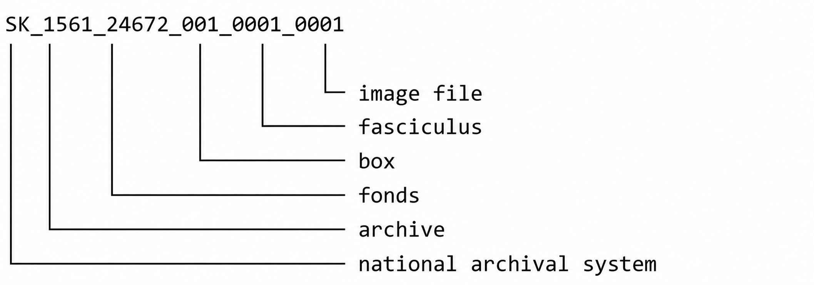

# Ongoing Work: Data for Human Review {.appendix}

## Abstract

Many interoperability, knowledge graph, metadata harmonisation, and AI-assisted data processing workflows ultimately depend on human judgement. Automated systems can often narrow ambiguity, identify candidate correspondences, and generate plausible semantic assertions, but they frequently cannot determine with sufficient confidence whether a claim should be corroborated, rejected, or referred for further review[^dfhr-1].

[^dfhr-1]: You can download and use this working paper separately. Daniel Antal: *Data for Human Review*. Manuscript. <https:://doi.org/10.5281/zenodo.20747805>. Contact: <https://reprex.nl/contact/>

This paper introduces `Betwixt`, a lightweight model for representing and reviewing semantic claims. `Betwixt` reduces the cognitive burden of semantic review by allowing claims to be assessed at the most appropriate level of abstraction. Its pragmatic approach represents a claim as a scoped assertion consisting of four components: scope, subject, predicate, and value. The model is intentionally simple. Rather than defining a new ontology, graph format, or review platform, it provides a minimal semantic representation that can be rendered through existing templating systems and reviewed through existing user interfaces.

At the core of the model is a provenance-preserving review pipeline in which observations give rise to candidate claims, candidate claims are subjected to human review, and review outcomes create reviewed claims together with an explicit stabilisation history. In this way, `Betwixt` separates the provenance of observations from the provenance of review while maintaining both as first-class elements of the semantic workflow.

The objective is to provide a common review layer between observation and semantic object. `Betwixt` is designed to support semantic stabilisation by making candidate claims explicit, reviewable, and reproducible while remaining independent of any specific software environment.



## Introduction

Many contemporary data workflows rely on semantic assumptions that remain invisible until they fail.

A survey harmonisation project may assume that two variables measure the same concept. An authority control workflow may assume that two identifiers refer to the same person. A knowledge graph federation process may assume that two entities occupy equivalent semantic roles. An OCR workflow may assume that a manuscript page is written in Latin.

These assumptions are often too uncertain for fully automated processing and too numerous for unrestricted manual review. The challenge is therefore not merely one of data integration or metadata management, but of human judgement under constrained resources.

`Betwixt` addresses this problem by treating semantic assertions as explicit review objects that move through a reproducible review and provenance pipeline:

```         
observation provenance
        ↓ 
 candidate claim          
        ↓ 
 review provenance
        ↓ 
  reviewed claim 
        ↓ 
     outcome
```

A *candidate claim* is derived from one or more observations and inherits their provenance. The claim is then subjected to human *review*, creating a second layer of provenance that records who *reviewed the claim*, under what conditions, and with what *outcome*. The result is not merely an accepted or rejected assertion, but a reviewed claim whose semantic content and stabilisation history are both explicitly represented.

A central premise of `Betwixt` is that semantic review should occur at the most useful level of abstraction. Rather than repeatedly reviewing identical assertions for hundreds of observations, reviewers should be able to assess broader contextual claims and concentrate their effort on exceptions, ambiguities, and conflicting evidence. `Betwixt` therefore treats review not as a workflow-management problem, but as a practical mechanism for allocating scarce human attention where it creates the greatest semantic value.

## The Scoped Claim

The fundamental `Betwixt` object is a scoped claim:

| scope | subject | predicate | value |
|-------|---------|-----------|-------|
| box45 | page    | language  | Latin |

The meaning of a claim derives not only from its subject, predicate, and value, but also from the scope within which the claim is made.

At first glance, this may appear unnecessarily indirect. Why not simply record the language of every page individually? The answer is that semantic review often benefits from operating at the highest level where a claim is likely to be true.

Consider an archival box containing 240 scanned page images. An archivist may know from the inventory, provenance, or previous research that the box contains correspondence written almost entirely in Latin. Instead of recording the claim

> page language Latin

240 times, the claim can be attached to the box itself:

|       |         |           |       |
|-------|---------|-----------|-------|
| scope | subject | predicate | value |
| box45 | page    | language  | Latin |

Archivists would recognise this as a statement made at a particular level of description. The box is described as containing Latin-language manuscripts, even though the claim ultimately concerns the individual pages and documents contained within it.

The practical advantage is that the claim can be inherited by the contained objects. Every page in the box may initially inherit the language claim "Latin" without requiring separate manual annotation. Human review can then focus on potential exceptions rather than repeatedly confirming the obvious. The review task becomes:

> Are there any pages that are not Latin?

instead of

> Is page 1 Latin?
>
> Is page 2 Latin?
>
> Is page 3 Latin?
>
> ...

This distinction dramatically reduces cognitive burden. Human effort is concentrated on uncertainty rather than repetition.

The same principle appears in many other domains. A survey harmonisation project may assign a concept to an entire variable before reviewing exceptional response categories. A knowledge graph federation workflow may propose that all entities from a trusted authority file represent persons before examining ambiguous cases. A filesystem reconstruction workflow may infer that all files within a directory belong to the same project and then review only the files that appear inconsistent with that assumption.

In each case, scope acts as a mechanism for contextual inheritance. Claims are made at the most useful level of abstraction and then reviewed through their exceptions. Betwixt therefore treats scope not merely as contextual metadata but as a practical tool for reducing the cost of semantic stabilisation.

Moving from a box to its contents illustrates a top-down stabilisation process. We begin with a broad claim about a record set and allow that claim to be inherited by the records, documents, or pages contained within it. Human review then focuses on exceptions that challenge the inherited claim.

However, semantic stabilisation often proceeds in the opposite direction. Instead of beginning with a broad claim, we may start with a narrowly scoped observation and progressively aggregate it into larger semantic structures.

For example:

| scope                | subject | predicate | value            |
|----------------------|---------|-----------|------------------|
| country=AD;year=2023 | country | GDP       | 3.73 billion EUR |

The scope refers to a geopolitical entity (AD = Andorra) and a specific time period (the calendar year 2023). The claim states that the gross domestic product produced within this scope was 3.73 billion EUR.

Additional claims may then be added for Andorra in 2024, San Marino in 2023, Liechtenstein in 2022, and so forth. These individual claims can be combined into a statistical dataset, a multidimensional data cube, or a larger economic knowledge graph.

This illustrates a bottom-up stabilisation process. Rather than inheriting a claim from a broader context, we begin with highly specific observations and progressively aggregate them into larger semantic structures. This is the workflow of official statistics. For example, Eurostat coordinates the collection of data from the member states of the European Union at multiple territorial levels. Statistical observations may be collected at the level of municipalities, districts, counties, regions, and countries, and subsequently aggregated into indicators for the euro area and the European Union as a whole. Each level inherits meaning from the lower levels while simultaneously creating a broader context for interpretation.

A similar process occurs in archives, although archivists use a different vocabulary. An archivist may begin with individual records, letters, photographs, or administrative documents and progressively establish contextual relationships among them. Records become files, files become series, series become collections, and collections become fonds. In archival terminology, the level of description moves upward from the individual record toward increasingly contextualised record sets.

What is notable is that regardless of whether we start from a narrow scope, such as a single statistical observation representing the GDP of Andorra in 2023, or from a broader scope, such as a box of manuscripts, the same semantic structure applies.

| scope                | subject | predicate | value            |
|----------------------|---------|-----------|------------------|
| country=AD;year=2023 | country | GDP       | 3.73 billion EUR |

and

|           |             |               |           |
|-----------|-------------|---------------|-----------|
| **scope** | **subject** | **predicate** | **value** |
| box45     | page        | language      | Latin     |

originate from very different domains, yet they can be represented using the same semantic pattern.

In the first example, the scope identifies a highly specific statistical observation. In the second example, the scope identifies a record set whose properties may be inherited by the records it contains. Between these extremes lie many other possibilities: survey variables, filesystem directories, authority files, museum collections, Wikibase entities, or multidimensional statistical cubes.

The introduction of scope therefore serves two complementary purposes. It provides a mechanism for contextual inheritance when moving from broader descriptions to more granular observations, and it provides a mechanism for aggregation when moving from individual observations to larger semantic structures. In both cases, scope allows semantic assertions to remain meaningful without requiring immediate translation into a graph representation.

More importantly, scope allows human review to take place at the most appropriate level of abstraction. Rather than repeatedly reviewing identical claims for hundreds of individual observations, reviewers can assess broader contextual claims and focus their attention on exceptions, ambiguities, and potentially conflicting evidence. In this sense, scope is not merely a modelling device; it is a mechanism for allocating scarce human attention where it creates the greatest semantic value.

## Review as Semantic Stabilisation

`Betwixt` assumes that claims often originate from incomplete observations, automated inference, machine learning systems, or heuristic matching processes.

The purpose of review is not to verify every component of a claim simultaneously. Instead, review focuses on stabilising one or more semantic components.

A reviewer may be asked to evaluate:

- a candidate value;
- a candidate predicate;
- a candidate subject;
- or any combination thereof.

The reference implementation focuses on value review, but the model itself is not restricted to any particular review target.

Review outcomes are intentionally simple:

- corroborated;
- rejected;
- referred (to further review).

The objective is not workflow management but semantic stabilisation.

### From Candidate Claims to Reviewed Claims

Betwixt operates on semantic claims in two states: a candidate state and a reviewed state.

A candidate claim represents a semantic assertion that is sufficiently plausible to be reviewed but not yet sufficiently corroborated to be treated as a stable semantic object. Candidate claims may originate from human observation, statistical processing, filesystem reconstruction, metadata extraction, authority control workflows, knowledge graph federation, machine learning systems, or AI-assisted inference.

| scope | subject | predicate | value |
|-------|---------|-----------|-------|
| box45 | page    | language  | Latin |

The objective of review is not merely to approve or reject the claim. The objective is to transform a candidate claim into a reviewed claim while making the review process explicit and reproducible.

Betwixt therefore treats review as a transformation of tabular data. Candidate claims are rendered into review interfaces, and the result of the review is a new tabular dataset containing the reviewed semantic elements together with provenance information describing how the review was performed.

The reference implementation uses Mustache templates to render candidate claims into lightweight serverless HTML and CSS documents. These documents are intended to minimise cognitive burden by presenting only the semantic components that require human judgement. In the simplest workflow, the review target is the value component of a claim. More advanced implementations may allow review of the subject, predicate, or any combination of semantic components.

For example, a candidate claim may be represented as:

|       |         |           |                 |
|-------|---------|-----------|-----------------|
| scope | subject | predicate | value_candidate |
| box45 | page    | language  | Latin           |

After review, the resulting dataset may contain:

|       |         |           |                 |                |
|-------|---------|-----------|-----------------|----------------|
| scope | subject | predicate | value_candidate | value_reviewed |
| box45 | page    | language  | Latin           | Latin          |

or

|       |         |           |                 |                |
|-------|---------|-----------|-----------------|----------------|
| scope | subject | predicate | value_candidate | value_reviewed |
| box45 | page    | language  | Latin           | German         |

In `Betwixt`, review is represented as data. The outcome of review is not merely a judgement but a new tabular object that records candidate claims, reviewed claims, review provenance, and review outcomes.

The reviewed dataset remains a tabular representation and can therefore be processed using ordinary data-management tools, exported to CSV, transformed into RDF, integrated into metadata frameworks, or used as input for subsequent review stages.

### Review outcomes

Review outcomes follow a deliberately pragmatic model inspired by the philosophy of science and neopragmatist accounts of knowledge creation. Rather than treating claims as permanently verified or falsified, Betwixt records their current status within an evolving process of semantic stabilisation.

Typical outcomes include:

| candidate | reviewed | status       |
|-----------|----------|--------------|
| Latin     | Latin    | corroborated |
| Latin     | German   | rejected     |
| Latin     | NA       | referred     |

- corroboratee: the reviewed claim is sufficiently stable for the intended purpose;

- rejected: the candidate claim should not be retained in its current form;

- referred: the claim requires additional evidence, a different review procedure, or a different reviewer.

The reviewed claim, together with its provenance chain, becomes the starting point for the next iteration of semantic stabilisation. Corroborated claims may be published, reused, or subjected to further inference. Rejected claims may be removed, demoted, or revised. Referred claims may enter additional review workflows operating at a different level of abstraction or involving different expertise.

In this way, Betwixt treats review not as a terminal approval process but as a reproducible mechanism for transforming candidate semantic objects into progressively more stable and reusable semantic objects.

## Relation to Existing Approaches

`Betwixt` does not replace metadata frameworks, graph technologies, or data validation systems.

Rather, it occupies a complementary position.

| System       | Primary unit     |
|--------------|------------------|
| Tidy data    | Observation      |
| Frictionless | Data package     |
| DataSpice    | Dataset metadata |
| RDF          | Triple           |
| Betwixt      | Scoped claim     |

`Betwixt` can consume claims derived from datasets, filesystems, authority files, knowledge graphs, AI systems, or metadata catalogues and present them for human review.

The intellectual origins of `Betwixt` are closely related to the tidy data paradigm developed by Hadley Wickham [@wickham_tidy_2014]. One of the most significant contributions of tidy data was not technical but methodological. It translated concepts from relational algebra, database normalisation, and multidimensional statistical systems into a small number of practical rules that dramatically reduced the cognitive burden of data analysis.

In the deceptively simple tidy data model, each row represents an observation and each column represents a variable. This abstraction allows analysts to focus on analytical questions rather than on the mechanics of data storage, transformation, and integration. During the process of data wrangling, analysts progressively stabilise the identities of observations and the meanings of variables until they become suitable for analysis.

The tidy data model contains a remarkable amount of implicit semantic knowledge. An analyst understands that a variable named `CPI` refers to the *Consumer Price Index* rather than the *Corruption Perceptions Index*. Likewise, a country code such as `SM` is interpreted as *San Marino* rather than *Santa Monica* because the surrounding analytical context makes that interpretation obvious. Within a single workflow, this implicit understanding is often sufficient.

The situation changes when data leave their original analytical context. Reviewers, auditors, collaborators, future researchers, and automated systems frequently lack access to the assumptions that were obvious to the original analyst. Questions that were previously implicit become explicit:

- What does `CPI` mean?

- What unit of measurement was used?

- What population does the dataset represent?

- Are all observational units sovereign states?

- Who created the dataset?

- What evidence supports a particular classification or correspondence?

At this point, additional semantic information becomes necessary. Provenance, authorship, definitions, identifiers, validity constraints, temporal scope, and contextual assumptions must be made explicit if review is to remain efficient and reproducible.

Many technical solutions already exist for representing such information. Metadata standards, ontologies, knowledge graphs, and linked data technologies all contribute important capabilities. `Betwixt` does not attempt to replace these approaches. Instead, it focuses on a narrower problem: how semantic assumptions can be transformed into reviewable claims and presented at an appropriate level of abstraction for human judgement.

`Betwixt` does not reject graph representations. Rather, it postpones them. The claim model is intentionally tabular because tabular representations remain easier to inspect, transform, review, exchange, and render than graph structures in many practical workflows.

If tidy data can be understood as a practical bridge between relational algebra and statistical analysis, `Betwixt` can be understood as a practical bridge between semantic representations and human review. Its objective is not to maximise semantic expressiveness, but to minimise the cognitive effort required to stabilise semantic claims while preserving sufficient provenance, context, and evidence for reproducible decision-making.

In this sense, `Betwixt` follows the same pragmatic principle that contributed to the success of tidy data: provide enough semantic structure to support reliable work, but not so much structure that the review process becomes more expensive than the problem it seeks to solve.

## Reference Implementation

The reference implementation represents claims as tabular structures and renders them through Mustache templates.

```         
candidate_claim_df
        ↓
   render()
        ↓
 HTML / CSS
        ↓
   reviewer
        ↓
reviewed_claim_df
```

The essential operation of `Betwixt` is therefore a transformation from one tabular representation into another through human review.

The R reference implementation can be installed from GitHub:

``` r
# install.packages("pak")
pak::pak("dataobservatory-eu/betwixt")
```

In R, a claim is represented as a one-row tibble:

``` r
claim(
  scope = "box45",
  subject = "page",
  predicate = "language",
  value = "Latin"
)
```

A review target specifies which semantic component of a claim is subject to stabilisation.

The reference implementation reviews values, but the same mechanism can be applied to subjects, predicates, or any combination thereof. The claim structure itself remains unchanged; only the review target and review workflow differ.

The reference implementation renders candidate claims into lightweight review packets using Mustache templates and standard web technologies. A review packet presents candidate semantic assertions in a form that minimises cognitive burden while preserving the contextual information necessary for reproducible judgement.

The reviewed dataset contains both the candidate and reviewed semantic components together with provenance information describing the review process and its outcome. A reviewed claim therefore records not only a semantic assertion but also its stabilisation history.

For example:

| scope | subject | predicate | value_candidate | value_reviewed | outcome |
|-------|---------|-----------|-----------------|----------------|---------|

|       |      |          |       |       |              |
|-------|------|----------|-------|-------|--------------|
| box45 | page | language | Latin | Latin | corroborated |

|       |      |          |       |        |          |
|-------|------|----------|-------|--------|----------|
| box45 | page | language | Latin | German | rejected |

|       |      |          |       |     |          |
|-------|------|----------|-------|-----|----------|
| box45 | page | language | Latin | NA  | referred |

The resulting reviewed dataset remains a standard tabular object enriched with review metadata, including the provenance of the review process and the identity of the reviewer. The reviewed dataset therefore records both the semantic assertion and the circumstances under which it was stabilised.

Because the reviewed output remains a tabular representation, it can be processed using ordinary data-management tools, exported to CSV, transformed into RDF, integrated into DataSpice or Frictionless workflows, loaded into relational databases, or used as input for subsequent review stages.

This separation between claims and review provenance is intentional. The original claim may have originated from a statistical observation, a filesystem reconstruction process, an archival description, a knowledge graph, or an AI-assisted inference workflow. The reviewed dataset preserves both the provenance of the original claim and the provenance of the review that transformed it into a more stable semantic object.

The reference implementation prioritises portability and minimal infrastructure requirements. A review packet should be distributable, executable, and reviewable using only standard web technologies and a web browser. This design enables review workflows in environments where dedicated servers, databases, or workflow-management systems are unavailable or undesirable.

More dynamic implementations are also possible. For example, an R implementation may render claims through a Shiny application, while a Python implementation may use a web framework or notebook environment. Such interfaces can provide radio buttons, drop-down menus, assisted classification, or AI-generated candidate values. These alternative interfaces do not alter the underlying model; they merely provide different rendering environments for the same review process.

The model deliberately avoids dependence on any specific graph technology, ontology, database system, or software framework. Betwixt is intended as a portable review protocol that can operate wherever scoped claims can be represented in tabular form.

## Conclusion

`Betwixt` proposes a minimal model for representing semantic assertions as reviewable objects. By introducing scope as an explicit component of a claim and separating semantic representation from rendering, it provides a lightweight review layer that can be integrated into a wide range of interoperability, harmonisation, and knowledge management workflows.

The long-term objective is not the creation of a new review platform, but the definition of a portable semantic review model that supports the broader process of semantic stabilisation.

# Case study: Stabilisaing a richer archival description and a more granular level

## Problem

The Andrássy archive provides an unusually useful test case for semantic stabilisation because the archival hierarchy is only partially observable.

The digital surrogates are organised according to a relatively clean archival structure:

{fig-align="center"}


The problem is that the observed units are digital images rather than archival records. A letter may contain multiple pages, and both sides of a page may be scanned separately.

Consequently:

```         
image ≠ page image ≠ letter 
```

The relationship between the observed digital objects and the underlying archival entities is therefore incomplete:

```         
Record Set (fonds)
    ↓
Record Set (box)
    ↓
Record Set (fasciculus)
    ↓
Record (letter)
    ↓
Record Part (page)
    ↓
Instantiation (digital image)
```

Depending on the quality and granularity of the original archival description, we may possess reliable descriptions at the level of the fonds, box, or fasciculus, while only directly observing digital instantiations of record parts. The intermediate layers—the record itself and potentially the lowest record-set level—remain unknown.

When observing a file such as:

```         
SK_1561_24672_001_0001_0001.jpg 
```

we can derive a chain of candidate claims:

```         
evidence_id archive fonds box fasciculus filename filepath 
```

These claims are themselves subject to review. Previous digitisation activities revealed misplaced or misnamed files, and simple inference tools can already identify probable inconsistencies, such as references to non-existent boxes or fasciculi.

The challenge is therefore not only to enrich archival metadata, but also to stabilise the relationship between digital surrogates and the archival structures they are presumed to represent.

## Hypothesis

We hypothesise that semantic stabilisation can proceed effectively even when the record layer is initially unknown.

Instead of beginning with the difficult task of reconstructing individual records from hundreds of scanned images, we begin with claims at a higher level of description and review them through exceptions.

For example, before an OCR workflow, we may wish to establish the language of the documents contained in a fasciculus.

A conventional workflow proceeds as follows:

```         
identify records
      ↓ 
describe language 
```

This requires reviewers to first determine record boundaries and then repeatedly assign language labels to individual pages.

We propose an alternative workflow:

```         
identify language      
       ↓ 
helps identify records 
```

A candidate claim may be formulated at the fasciculus level:

| scope    | subject | predicate | value |
|----------|---------|-----------|-------|
| fasc0001 | page    | language  | Latin |

This claim can be reviewed through exception detection rather than page-by-page confirmation.

Formally, the scope establishes an inheritance hierarchy:

```         
fasciculus    
    ↓ 
record (unknown)    
    ↓ 
record part (unknown)    
    ↓ 
instantiation (jpg) 
```

or:

```         
fasciculus ⊇ record ⊇ record_part ⊇ instantiation 
```

The candidate claim is:

```         
∀x ∈ fasciculus : language(x) = Latin 
```

The reviewer is then asked to search for counterexamples:

```         
∃x ∈ fasciculus : language(x) ≠ Latin 
```

Rather than validating every page individually, the reviewer evaluates the validity of a generalisation.

If no counterexamples are found, the Latin-language claim can be inherited by all records, record parts, and digital instantiations contained within the fasciculus, even before the record boundaries have been fully established.

If counterexamples are discovered, they remain valuable observations. A multilingual fasciculus may contain Latin, German, Slovak, and Hungarian correspondence. These linguistic transitions often provide strong evidence for previously unknown record boundaries.

For example:

```         
scope = fasc0001
subject = page
predicate = language
value = Latin

For all pages within fasc0001,
language = Latin
unless an exception is identified.
```

Even before individual letters have been identified, the transition between `page003` and `page004` provides evidence for a plausible record boundary.

Language review therefore contributes simultaneously to two stabilisation processes:

```         
language identification          
         ↓ 
record identification 
```

The central hypothesis of this study is that carefully selected inherited claims can substantially reduce reviewer effort while simultaneously generating evidence for the reconstruction of missing archival structures. Rather than requiring reviewers to repeatedly describe what is already highly probable, semantic stabilisation directs human attention to uncertainty, exceptions, and boundary cases, where expert judgement contributes the greatest value.

In a simple example, reviewing the language of seven page images can generate far more than seven isolated annotations. The review may produce approximately sixty structured claims, including filename-derived structural observations, reviewed language assertions, and a further set of inferred claims concerning language clusters, candidate record boundaries, candidate records, and record-set composition. The precise number depends on the extent to which reviewed claims are propagated through the archival hierarchy.

The significance of this approach lies not only in reducing repetitive work, but also in the cumulative value of review. Each stabilised claim becomes a source of evidence that can support subsequent review tasks. A later review of a box of correspondence, for example, may focus on distinguishing envelopes from their contents. Although cognitively simple, such a task can contribute to the stabilisation of record identity, the reconstruction of record boundaries, and the refinement of archival structure. Human review therefore becomes progressively more informative: each intervention not only resolves a local uncertainty but also strengthens the evidential basis for future interpretation and reconstruction.

Human review is treated not as a sequence of isolated annotations, but as a process of evidence accumulation. Each reviewed claim has the potential to stabilise multiple related claims across different levels of description, allowing a small number of carefully designed review tasks to contribute simultaneously to description, classification, and structural reconstruction.

In our example, the reviewer places only seven labels on a review interface—or, in the simplest case, merely identifies seven counterexamples—yet contributes evidence supporting approximately sixty structured claims. The value of review therefore lies not only in the direct annotations produced, but also in the additional claims that can be inherited, projected, corroborated, or inferred from them.

A broader challenge for information and computational science is to design review workflows that maximise the evidential value of human intervention. One objective is to maximise the number and quality of stabilised claims that can be supported by a minimal amount of human review. The dual objective is to minimise the amount of human effort required to describe, classify, and reconstruct large observational sets to a specified level of quality and confidence.

Semantic stabilisation approaches this challenge by concentrating scarce human attention on uncertainty, ambiguity, and exceptions, while allowing highly probable claims to be inherited through explicit contextual and evidential relationships. The goal is therefore not to maximise the volume of annotations produced, but to maximise the informational value of expert judgement.

## From Review Events to Semantic Enrichment

The value of semantic stabilisation is not merely that it confirms a single property of a document. A carefully designed review can generate a large number of corroborated claims and new inference candidates.

Consider a fasciculus whose pages are reviewed for language:

```         
page001  Latin 
page002  Latin 
page003  Latin  
page004  German 
page005  German  
page006  Latin 
page007  Latin 
```

At first glance, this appears to be a simple language review. In reality, a single review activity contributes evidence to several different semantic structures.

### Provenance Claims

The review creates provenance information about the reviewed objects:

```         
page001   
   language = Latin   
   reviewed_by = Reviewer A   
   review_date = 2026-07-01  
   
page004   
   language = German   
   reviewed_by = Reviewer A   
   review_date = 2026-07-01 
```

These claims can be attached directly to the digital instantiations represented by the image files.

### Inheritance Claims

The review also corroborates higher-level claims.

For example:

```         
scope = fasc0001 
subject = page 
predicate = language 
value = Latin 
```

remains valid for most pages in the fasciculus.

The reviewer has not merely established properties of individual files. The review has generated evidence about the entire record set.

### Record-Boundary Candidates

The language transitions generate candidate record boundaries.

```         
page003 → Latin page004 → German 
```

suggests a possible transition between two letters.

Similarly:

```         
page005 → German page006 → Latin 
```

suggests another transition.

The language review therefore contributes directly to the reconstruction of missing record identities.

### Grouping Candidates

Once language clusters emerge, pages can be grouped into candidate records:

```         
candidate_record_01   page001   page002   page003  candidate_record_02   page004   page005  
candidate_record_03   page006   page007 
```

These are not yet archival records. They are review-generated hypotheses that can be evaluated in later iterations.

### OCR Workflow Optimisation

Language review also enables the selection of specialised OCR workflows.

For example:

```         
Latin pages   → Latin OCR model  
German pages   → German OCR model 
```

The review therefore contributes directly to downstream processing quality.

### Archival Description Enrichment

Once record boundaries become more stable, inherited language claims can be projected upward:

```         
record_01   language = Latin  
record_02   language = German 
```

and eventually:

```         
fasciculus   
   contains Language = Latin   
   contains Language = German 
```

These claims enrich the archival description without requiring separate cataloguing activities.

### Ontological Pattern

The important observation is that a single review activity simultaneously affects multiple layers of the archival model:

```         
instantiation       
    ↓ 
record part       
    ↓ 
  record       
    ↓ 
 record set 
```

A language review of a digital image is therefore not merely a statement about that image. It creates evidence that can be propagated upward through inheritance and used to stabilise previously unknown semantic structures.

The same pattern can be applied to other properties such as handwriting, script, document type, correspondent, date range, condition, OCR quality, or named entities. Semantic stabilisation is therefore not primarily a metadata creation process. It is a process for generating and corroborating semantic structure from a small number of carefully designed review activities.

# Case study: Translator Authority Files

## Translator Namespace and Authority-File Stabilisation

### Problem

Libraries maintain rich authority systems that connect bibliographic records, contributors, and controlled vocabularies. In principle, authority management follows a hierarchical structure.

A local library authority file should ideally be aligned with a national authority file, which in turn should be aligned with international authority systems such as VIAF.

``` text
Local authority file
         ↓
National authority file
         ↓
VIAF
```

In practice, however, this ideal hierarchy is only partially realised.

Many libraries use integrated library systems such as Aleph or SiMS that maintain local authority files for authors, editors, translators, photographers, and other contributors. The quality of these authority records depends on the practices of individual cataloguers and on the availability of external authority records.

Translator identities are particularly challenging. Translators often receive less attention than authors, and many translators are represented only through their participation in specific manifestations. While some translators possess well-established authority records because they are also literary authors, researchers, or public intellectuals, many remain weakly identified.

The result is a fragmented authority landscape:

``` text
VIAF authority
      ↓
National authority
      ↓
Library authority
      ↓
Bibliographic manifestation
```

where the identity of the translator may be stable at some levels and unstable at others.

When observing a MARC record, we can extract a rich set of observations:

``` text
041
245$c
700
710
024
856
```

For example:

``` text
041 1
a) hun
h) jpn

700
a) Tóth, László
e) ford.
```

These observations immediately create candidate claims:

``` text
manifestation
  language = Hungarian

source_work
  language = Japanese

person
  role = translator

manifestation
  translated_from = Japanese
```

Yet the identity of the translator remains uncertain.

A single individual may appear as:

``` text
Tóth, László
Gy. Tóth László
Tóth L.
Tóth, György László
```

while different individuals may share identical or nearly identical names.

The challenge is therefore not merely to extract metadata from MARC records, but to stabilise translator identities across heterogeneous authority systems.

### Hypothesis

We hypothesise that translator identities can be stabilised more efficiently through semantic identity profiles than through name matching alone.

A person's name is often a weak identifier.

A translator's professional activity, however, leaves a distinctive semantic footprint:

``` text
translator
      ↓
authors translated
      ↓
language pairs
      ↓
publishers
      ↓
publication dates
      ↓
authority identifiers
```

For example:

``` text
Tóth, László

Japanese → Hungarian

Murakami Haruki
Kawabata Yasunari
Mishima Yukio

Publisher:
  Európa

Active:
  1995–2020
```

This pattern may uniquely identify a translator even when authority identifiers are missing.

Instead of asking a reviewer:

``` text
Is
"Tóth, László"

the same person as

"Gy. Tóth László"?
```

we can present an identity profile:

``` text
Names:
  Tóth, László
  Gy. Tóth László

Language pair:
  Japanese → Hungarian

Authors translated:
  Murakami
  Kawabata

Publishers:
  Európa

Publication period:
  1995–2020
```

and ask whether the observations are consistent with a single translator identity.

The review task therefore shifts from name comparison to profile corroboration.

### Semantic Stabilisation Workflow

The traditional workflow is often implicit:

``` text
identify person
      ↓
link manifestations
```

Our proposed workflow reverses this process:

``` text
identify translation patterns
          ↓
helps identify person
```

A cluster of MARC records may already provide strong evidence for identity through recurring combinations of:

``` text
translator role
source language
target language
translated authors
publisher
publication period
```

These patterns create candidate identity profiles.

A reviewer then evaluates the profile rather than individual bibliographic records.

### Ontological Pattern

The key observation is that a single identity review may stabilise a large number of related claims.

A review of one translator profile can simultaneously corroborate:

``` text
translator identity

translator ↔ manifestation

translator ↔ author

translator ↔ language pair

translator ↔ publisher

translator ↔ authority record
```

A single review event therefore affects multiple layers of the bibliographic graph:

``` text
authority
      ↓
person
      ↓
translator role
      ↓
manifestation
      ↓
work
```

The central hypothesis of this study is that carefully designed identity-profile reviews can maximise the evidential value of human intervention. Rather than repeatedly inspecting individual MARC records, reviewers evaluate higher-level semantic patterns that propagate through many manifestations and authority records simultaneously.

As in the archival case study, human effort is concentrated on uncertainty and exceptions. The objective is not to maximise the number of manual corrections, but to maximise the number of stabilised claims that can be supported by a small number of carefully designed review decisions.

## Synergies

The two examples have a similar logic, even though the stabilisation target and the target of the review is different.

| Andrássy archive              | Translator namespace             |
|-------------------------------|----------------------------------|
| Observed: image               | Observed: MARC manifestation     |
| Missing: record               | Missing: person identity         |
| Review: language              | Review: identity profile         |
| Pattern: language clusters    | Pattern: translation clusters    |
| Output: record reconstruction | Output: authority reconstruction |

# Case Study: Bratislava City Library

### Problem

The library contains heterogeneous descriptions of musical works and recorded manifestations originating from different cataloguing traditions, metadata standards, and authority systems.

The observed objects are manifestations:

```         
printed score 
sound recording 
    CD 
    LP 
    digital release
```

while the semantic objects of interest are:

```         
composer 
musical work
    manifestation

expression 
  recording
     manifestation 
```

The challenge is that identities are often stable at one level and unstable at another.

For example:

```         
Beethoven
     ↓ 
stable: Symphony No. 5
     ↓ 
mostly stable : specific edition
     ↓ 
partly stable:  specific recording
     ↓ 
often unstable
```

### Hypothesis

We hypothesise that work identities can be stabilised before recording identities, and that work stabilisation substantially reduces the effort required to stabilise recordings.

A conventional workflow might attempt:

```         
identify recording
     ↓ 
identify work
     ↓ 
identify composer
```

We propose the opposite:

```         
identify composer
      ↓ 
  identify work
      ↓ 
identify manifestation
      ↓ 
identify recording
```

or even:

```         
identify printed manifestation
       ↓ 
helps identify work
       ↓ 
helps identify recording
```

### Identity Profiles

A musical work can often be identified through recurring semantic patterns:

```         
composer 
title 
opus number 
catalogue number 
key 
genre 
publication history
```

For example:

```         
Ludwig van Beethoven Symphony No. 5 Op. 67 C minor
```

is already a strong work profile.

A recording can then inherit much of this stabilised structure.

### Ontological Pattern

The key inheritance chain becomes:

```         
composer      
   ↓  
musical work
   ↓ 
work manifestation
   ↓ 
recorded manifestation
```

or:

```         
composer ⊇ work ⊇ manifestation ⊇ recording
```

in the sense that higher-level identities constrain and inform lower-level identities.

### Semantic Stabilisation Pattern

A review that confirms:

```         
this printed score      = Beethoven Op.67
```

does not merely stabilise a single bibliographic record.

It contributes evidence for:

```         
composer identity
work identity  
manifestation identity  
relationships between editions  
relationships between recordings
```

and potentially dozens of catalogue records.

### Synergies

| Case study               | Missing semantic object |
|--------------------------|-------------------------|
| Andrássy archive         | Record                  |
| Translator namespace     | Person                  |
| Bratislava music library | Work / Recording        |

The underlying pattern is identical:

```         
observations        
   ↓ 
candidate profile        
   ↓ 
human review
   ↓ 
stabilised semantic object
```

but the semantic object changes:

```         
record 
person 
work
```

which is a very strong argument that semantic stabilisation is not domain-specific but a general methodology. And that is exactly the point your working paper is trying to make.

# Case Study: FinFAIR

## Problem

The Latvian Folklore Archive and related collections contain large numbers of digital artefacts with incomplete descriptions.

For example:

```         
fieldwork photographs sheet music sound recordings drawings manuscripts
```

may exist as thousands of JPG, TIFF, WAV, or PDF files, while only a fraction possess detailed metadata.

A curator may assemble a thematic collection:

```         
Latgale expedition 1954–1957 women in traditional dress
```

and produce a WACZ package containing hundreds or thousands of candidate images.

The collection already possesses considerable contextual information:

```         
expedition researchers informants location date collection
```

but many individual artefacts remain poorly described.

The challenge is not merely to enrich metadata but to establish whether a digital twin can be safely and meaningfully published.

## Hypothesis

We hypothesise that rights-aware cultural digital twins can be stabilised through a sequence of low-cognitive-burden review tasks.

Rather than asking reviewers to fully describe every photograph, we begin with a small number of high-value review decisions.

For example:

```         
scope review
     ↓ 
rights review
     ↓ 
content review
```

### Review 1: Scope Stabilisation

The first review establishes whether the artefact belongs to the intended collection.

A curator searching for:

```         
women in traditional dress
```

may encounter:

```         
photograph of woman photograph of group photograph of house photograph of boat drawing sheet music
```

The review question is:

```         
Does this artefact belong to the review scope?
```

Candidate claims:

| scope       | subject | predicate      | value |
|-------------|---------|----------------|-------|
| latgale1955 | image   | depicts_person | yes   |

or:

| scope       | subject | predicate     | value      |
|-------------|---------|---------------|------------|
| latgale1955 | image   | artefact_type | photograph |

This review primarily stabilises the collection boundary. The aim is to rule out accidentally added files about drawings, or buildings, or any out-of-scope images.

### Review 2: Personality Rights Stabilisation

The second review establishes the human subjects represented in the image.

For example:

| scope    | subject | predicate | value |
|----------|---------|-----------|-------|
| image123 | person  | present   | yes   |

followed by:

| scope    | subject | predicate  | value      |
|----------|---------|------------|------------|
| image123 | person  | identified | Anna Ozola |

or:

| scope    | subject | predicate  | value   |
|----------|---------|------------|---------|
| image123 | person  | identified | unknown |

The important outcome is not only identification.

The review contributes directly to rights assessment.

For example:

```         
identified person         
    ↓ 
 birth date
    ↓ 
likely deceased
```

or:

```         
unknown person        
     ↓ 
requires restricted publication
```

The resulting claim is not merely descriptive.

It has policy consequences. We can allow any researcher to work with Digital Twins that are not restricted, and only allow Latvian Folk Archive researchers to work with Digital Twins where the rights status is risky.

### Review 3: Content Stabilisation

Once publication constraints are understood, reviewers can enrich the collection.

For example:

| scope    | subject | predicate | value       |
|----------|---------|-----------|-------------|
| image123 | dress   | type      | traditional |

or:

| scope    | subject | predicate    | value    |
|----------|---------|--------------|----------|
| image123 | dress   | authenticity | original |

Possible classifications:

```         
traditional costume 
reconstructed costume 
ethnographic dress (unknown traditionality)
rural dress 
other clothing
```

These claims enrich the digital twin itself.

## Ontological Pattern

Unlike the previous case studies, this workflow simultaneously stabilises three different dimensions:

```         
artefact identity        
    ↓ 
rights status
    ↓ 
content description
```

or:

```         
What is it?
    ↓
Who is affected?
    ↓ 
What does it depict?
```

The resulting digital twin becomes:

```         
digital artefact         
   + provenance
   + rights status
   + semantic description
```

rather than a simple metadata record.

## Semantic Stabilisation Pattern

The key observation is that a single review event may simultaneously generate:

```         
descriptive claims 
identity claims 
rights claims 
publication-policy claims 
collection-enrichment claims
```

For example, confirming:

```         
one identifiable person traditional costume photograph
```

may immediately support:

```         
personality-rights assessment  
publication eligibility
costume classification
collection inclusion
future image-discovery workflows
```
