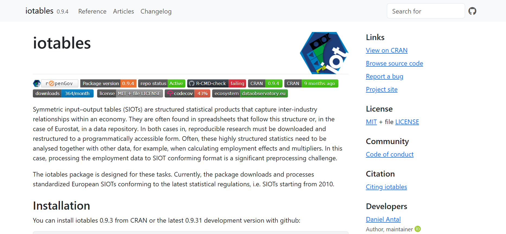
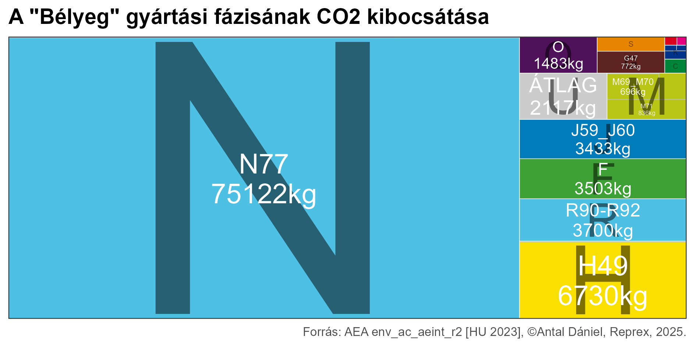
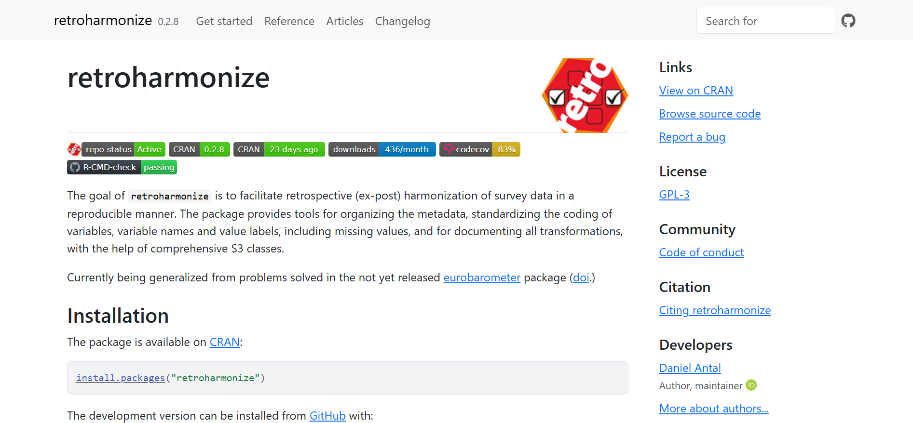
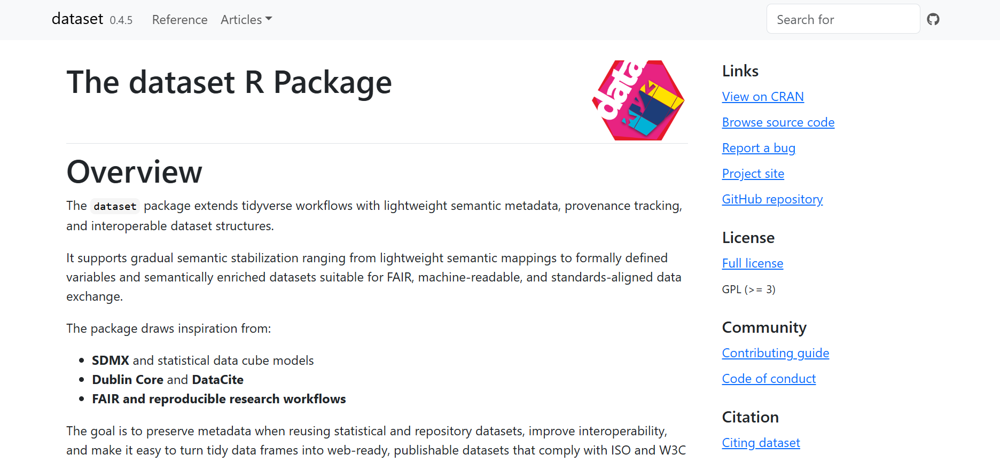
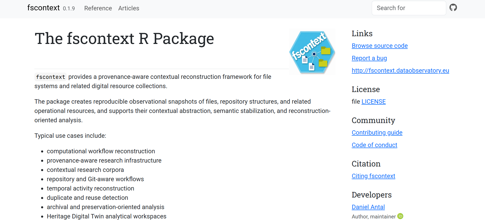

# Research and Innovation Agenda

```{=html}
<!---
..., —
--->
```

`Semantic stabilisation` is the process of transforming incomplete, ambiguous, heterogeneous, or partially conflicting observations into sufficiently coherent semantic representations that support reproducible inference, communication, and practical decision-making.

The methodology developed in this research programme is grounded in empirical case studies and implemented through a portfolio of R software libraries. It is inspired by the tidyverse ecosystem and, in particular, Hadley Wickham's influential formulation of the [tidy data paradigm](https://vita.had.co.nz/papers/tidy-data.pdf)[^innovation-1]. Prior to the widespread adoption of tidy data, analytical workflows often involved fragile, poorly documented transformations between heterogeneous data sources, spreadsheets, relational databases, and statistical software. Although the underlying mathematical and database concepts were well understood, they remained inaccessible to many practitioners and difficult to apply consistently in everyday analytical work.

[^innovation-1]: Hadley Wickham: *Tidy Data* [@wickham_tidy_2014]

The success of tidy data was not primarily technical but methodological. By reducing complex ideas from relational algebra, statistical observation models, and database normalisation into a small number of intuitive principles, tidy data enabled reproducible analytical workflows on an unprecedented scale. In Lakatosian terms, it can be viewed as a highly progressive research programme: a simple heuristic generated a large ecosystem of tools, methods, and applications while remaining compatible with established statistical and computational foundations.

Semantic stabilisation addresses a different but analogous problem. If tidy data provides a practical bridge between statistical analysis and relational algebra, semantic stabilisation seeks to provide a practical bridge between heterogeneous observations and semantic knowledge systems. The objective is not merely to transform data into analysable tables, but to transform observations into semantic objects whose meaning, provenance, uncertainty, and relationships can be represented explicitly and reused across systems.

Semantic stabilisation begins where metadata ceases to be treated as a descriptive accessory and becomes a mechanism for establishing semantic correspondence. Just as Wickham changed how many analysts think about datasets, Jeffrey Pomerantz changed how many information scientists think about metadata[^innovation-2]. One of his enduring contributions is to treat metadata not as a technical add-on, but as a means of making resources understandable, interpretable, and actionable within a community of use.

[^innovation-2]: Jeffrey Pomerantz: *Metadata* [@pomerantz_metadata_2015]

This distinction is particularly important because many discussions of interoperability implicitly assume that metadata are self-explanatory. In practice, however, metadata themselves often require interpretation. Labels, definitions, classifications, identifiers, provenance statements, and descriptions may be incomplete, ambiguous, multilingual, or context-dependent. The existence of metadata therefore does not guarantee semantic correspondence. Rather, semantic correspondence emerges through a process of stabilisation that makes the meaning, scope, and intended use of metadata sufficiently explicit for communication, reuse, and inference.

This perspective directly informs the development of the `dataset` package (see @sec-dataset-package) and its `dataset_df` class. The package seeks to make explicit some of the semantic assumptions that remain implicit in conventional tidy workflows. By extending datasets with machine-readable definitions, provenance information, semantic relationships, and contextual metadata, `dataset_df` objects aim to become informative in Pomerantz's sense: not merely containers of observations, but semantic objects that can be interpreted, exchanged, and reused beyond their original analytical context.

## Two Dimensions of Semantic Stabilisation

Semantic stabilisation therefore complements tidy workflows by making some of this hidden semantic work explicit.

### Semantic Correspondence

Consider the labels

```         
Bela Bartoks
Bartók Béla
Béla Bartók
```

or

```         
cpi
consumer_price_index
inflation
```

These examples raise a question of semantic correspondence. Do these labels refer to the same underlying object or concept? If they do, they should be harmonised to the same semantic object even when their surface forms differ. In practice, this often means determining whether multiple observations should refer to the same row identifier, the same variable, or the same entity in a knowledge graph. Such harmonisation requires a precise understanding of meaning. The analyst must determine not only whether two labels refer to the same concept, but also whether important distinctions remain, such as different measures of inflation, different units, or different roles associated with a person.

### Representation Harmonisation

A second class of problems arises after semantic correspondence has already been established. Once we know that a given entity or concept is the same, we must still ensure that it can be represented consistently across languages, writing systems, and institutional contexts. For example,

```         
Béla Bartók
ベーラ・バルトーク
Бела Барток
Bartók Béla
```

and

```         
inflation
infláció
инфляция
インフレーション
```

are not competing identities but alternative representations of the same semantic object. A Japanese catalogue, a Hungarian authority file, and a Russian library system may all refer to the same composer or economic concept while requiring different labels, transliterations, descriptions, and user interfaces. The challenge is no longer identity resolution but representation harmonisation.

Semantic stabilisation therefore operates in two directions. First, it establishes semantic correspondence among heterogeneous observations by determining whether different labels, identifiers, or descriptions refer to the same underlying object. Second, it maintains coherent representations of stabilised semantic objects across languages, systems, and contexts of use. The former enables integration and inference; the latter enables communication, publication, federation, and reuse.

The semantic stabilisation lifecycle is an iterative process through which observations become reusable semantic objects. It begins under conditions of uncertainty, where meaning, identity, and correspondence cannot be taken for granted, and progressively reduces ambiguity through contextualisation, interpretation, review, and reuse.

```         
Observation
↓
Contextualisation
↓
Semantic correspondence
↓
Human Review
↓
Representation harmonisation
↓
Semantic object
↓
Publication
↓
Federation
↓
Knowledge inference
```

The lifecycle should not be interpreted as a strictly linear workflow. New observations, contextual evidence, competing interpretations, or inference results may require revisiting earlier stages. Semantic stabilisation therefore remains an iterative process in which semantic objects are continuously corroborated, refined, and reused.

## Methodological Inspirations

This research programme is informed by two philosophical perspectives that emphasise knowledge formation as a process rather than a final outcome.

Donald Davidson's concept of the radical interpreter provides a useful metaphor for semantic stabilisation under conditions of minimal prior knowledge. The interpreter enters a context where meanings cannot be assumed and must be inferred through observation, contextual clues, and iterative hypothesis formation. Similar situations arise in provenance research, namespace construction, and the identification of previously unknown entities.

Davidson's notion of "passing theories" provides a useful metaphor for semantic stabilisation. Actors do not begin with a shared language or ontology but progressively converge on interpretations that become sufficiently reliable for communication and action.

> > To make things easier, imagine that I am forming such a theory about the current behavior of a native of an exotic culture into which I have unexpectedly parachuted. This strange person, who presumably finds me equally strange, will simultaneously be busy forming a theory about my behavior. If we ever succeed in communicating easily and happily, it will be because her guesses about what I am going to do next, including why \[...\] To came to say that we speak the same language is to say, as Davidson puts it, that "we tend to converge on passing theories" Davidson's point is that all "two people need, if they are to understand one another through speech, is the ability to converge on passthing theories from utterance to utterance."
>
> Davidson's account of linguistic communication dispenses with the picture of language as a third thing intervening between self and reality, and of different languages as barriers between persons or cultures. To say that one's previous language was inappropriate for dealing with some segment of the world (for example, the starry heavens above, or the raging passions within) is just to say that one is now, having learned a new language, able to handle that segment more easily. To say that two communities have trouble getting along because the words they use are so hard to translate into each other is just to say that the linguistic behavior of inhabitants of one community may, like the rest of their behavior, be hard for inhabitants of the other community to predict.

Imre Lakatos's philosophy of science provides a complementary perspective on the progressive refinement of knowledge claims. Rather than treating semantic correspondences as simply true or false, semantic stabilisation treats them as hypotheses that may become increasingly corroborated or increasingly challenged as new evidence emerges.

> ... the typical descriptive unit of great scientific achievements is not an isolated hypothesis but rather a research programme. Science is not simply trial and error, a series of conjectures and refutations. ‘All swans are white’ may be falsified by the discovery of one black swan. But such trivial trial and error does not rank as science. Newtonian science, for instance, is not simply a set of four conjectures—the three laws of mechanics and the law of gravitation. These four laws constitute only the ‘hard core’ of the Newtonian programme. But this hard core is tenaciously protected from refutation by a vast ‘protective belt’ of auxiliary hypotheses. And, even more importantly, the research programme also has a ‘heuristic’, that is, a powerful problem-solving machinery, which, with the help of sophisticated mathematical techniques, digests anomalies and even turns them into positive evidence. For instance, if a planet does not move exactly as it should, the Newtonian scientist checks his conjectures concerning atmospheric refraction, concerning propaga­tion of light in magnetic storms, and hundreds of other conjectures which are all part of the programme. He may even invent a hitherto unknown planet and calculate its position, mass and velocity in order to explain the anomaly.

Together, these perspectives encourage an understanding of semantic stabilisation as an iterative process of interpretation, review, corroboration, and revision. Stabilisation does not conclude inquiry. On the contrary, successful stabilisation often creates new opportunities for inference, new questions, and new avenues of investigation.

### From 5-stars to 8-stars

The semantic staiblisation research and innovation agenda connects directly to the [8-star Linked Open Data model](https://seco.cs.aalto.fi/publications/2024/hyvonen-tuominen-8-star-2024.pdf) developed by Hyvönen and Tuominen[^innovation-3]. Their work argues that the classical 5-star model of Linked Open Data is not sufficient for effective reuse, because it does not adequately address three central problems: explicit data schemas, formal quality against those schemas, and trustworthiness with respect to the real-world phenomena being modelled.

[^innovation-3]: Eero Hyvönen and Jouni Tuominen: *8-star Linked Open Data Model: Extending the 5-star Model for Better Reuse, Quality, and Trust of Data* [@hyvonen_tuominen_8star_2024]

My research programme approaches the same reproducibility and reuse challenges from a complementary direction. Whereas the 8-star model defines additional publication-level requirements for reusable and trustworthy Linked Open Data, semantic stabilisation investigates the methodological and computational processes required to reach that level of quality. It asks how incomplete, ambiguous, heterogeneous, multilingual, or partially conflicting observations can be transformed into semantic objects whose meaning, provenance, uncertainty, and relationships are explicit enough to support reproducible inference, human review, and data exchange.

The motivation for this work does not arise from a failure of the FAIR principles or Linked Open Data. On the contrary, both have been highly successful in encouraging better data publication practices. However, practical experience across statistical production, survey harmonisation, rights management, digital collection management, economic analysis, and digital humanities research suggests that publication standards alone are often insufficient to ensure meaningful reuse. Researchers and institutions frequently struggle to operationalise interoperability and reusability in practice. As a result, FAIRness is sometimes treated as a compliance requirement rather than as an effective mechanism for enabling data reuse and reproducible knowledge creation.

The 8-star model can be interpreted as a recognition of this reality. The introduction of explicit schemas, formal validation, and trustworthiness extends the original 5-star model precisely because successful publication does not automatically lead to successful reuse. My research investigates the processes that precede and support these additional requirements. The central hypothesis is that semantic stabilisation provides a missing methodological layer between data creation and data publication. By making semantic assumptions explicit, documenting uncertainty, harmonising representations, and supporting human review, semantic stabilisation aims to provide researchers and practitioners with practical tools for achieving not only FAIR data, but data that can be confidently reused, federated, and subjected to both human and machine reasoning.

In this sense, semantic stabilisation can be understood as an operational methodology that supports the progressive achievement of all eight stars of reusable and trustworthy data. Inspired by Davidson's notion of radical interpretation, semantic stabilisation begins from situations in which meaning, identity, and correspondence cannot be taken for granted. The challenge is not merely to publish data according to a predefined standard, but to establish sufficient semantic coherence for publication, exchange, interpretation, and reuse.

Each star of the 8-star model can be viewed as a distinct stabilisation effort. The lower stars require agreement on formats, identifiers, accessibility, and linking. The higher stars require agreement on schemas, validation, trustworthiness, and explanations of uncertainty. In practice, these layers cannot be treated as independent. Meaningful linking requires sufficiently stable identities; schema validation requires sufficiently stable concepts; trustworthiness requires sufficiently stable provenance and interpretation. Progress at higher levels therefore depends on successful stabilisation at lower levels.

Semantic stabilisation does not replace the 8-star model, nor does it introduce an alternative maturity framework. Rather, it investigates the practical, methodological, and computational processes through which organisations progressively move from raw observations to reusable semantic objects. The objective is to understand how semantic assumptions, identities, correspondences, representations, and uncertainties can be made explicit and reviewed throughout the data lifecycle, enabling the different layers of the 8-star model to function coherently as an integrated whole.

The shared motivation is that FAIR and Linked Open Data principles, while essential, do not by themselves solve the reproducibility crisis. Data may be findable, accessible, interoperable, and formally valid while still being semantically misleading, poorly documented, difficult to reproduce, or untrustworthy for a particular research purpose. My contribution would be to develop software-supported, empirically grounded methods for making semantic assumptions explicit before data are published, federated, reused, or submitted to machine reasoning.

## Semantic Models, Ontologies, and Interoperability

This chapter would explain that semantic stabilisation operates on three layers:

- Conceptual models and ontologies
- Semantic stabilisation processes
- Operational knowledge systems

and then explain that the packages mostly address the second layer.

### Semantic Layering and Conceptual Models

A recurring theme throughout this research programme is that semantic interoperability cannot be reduced to data formats or technical standards alone. Interoperability emerges through the interaction of conceptual models, ontologies, governance arrangements, and practical use cases.

This perspective is informed by the layered architecture of the Semantic Web, where identifiers, vocabularies, ontologies, inference mechanisms, and user-facing applications operate as interconnected but distinct components of a larger knowledge infrastructure. Similar principles can be found in the European Interoperability Framework, which distinguishes legal, organisational, semantic, and technical layers of interoperability.

Rather than pursuing universal ontology alignment, this research programme investigates the use of semantic layering and reusable conceptual patterns that enable interoperability among heterogeneous knowledge systems while preserving contextual differences.

This work has involved the development, adaptation, and evaluation of conceptual models across several domains, including:

- statistical information systems based on SDMX and DDI;
- sustainability and environmental reporting frameworks;
- the Open Music Ontology and related rights-management vocabularies that provide briding from existing ontologies, and non-ontological metadata standards, particularly in DDEX;
- Records in Contexts (RiC) and archival knowledge systems;
- Wikibase-based knowledge graphs and namespace infrastructures;
- multilingual cultural heritage thesauri and authority systems.

The objective of these activities is not the creation of new ontologies as an end in themselves. Instead, conceptual models are treated as stabilisation artefacts that make semantic correspondence possible among observations, records, datasets, entities, and services operating across institutional and disciplinary boundaries.

Following the approach developed in recent work on federated cultural heritage infrastructures (see *Federating Open Knowledge through Wikibase: The Case of The Finno-Ugric Data Sharing Space* @sec-publication-dnhb-2025), particular emphasis is placed on modular ontological patterns, multilingual vocabularies, semantic layering, and pragmatic interoperability rather than comprehensive global alignment.

From the perspective of semantic stabilisation, conceptual models provide the semantic substrate on which harmonisation, federation, provenance reconstruction, contextualisation, and AI-assisted interpretation become possible.

## Reproducible Methodological Approach

This research programme develops and evaluates semantic stabilisation methods through a portfolio of peer-reviewed scientific software written primarily in R. The software serves as a reproducible research environment in which semantic stabilisation methods can be specified, implemented, tested, documented, and evaluated using real-world data and operational knowledge systems.

R is particularly suitable for this purpose because it combines readability, reproducibility, and rapid methodological development. Methods developed in R can subsequently be implemented in other environments, including Python, Java, C++, web applications, and production-scale knowledge graph infrastructures.

The software itself is not the primary scientific contribution. Rather, it functions as an experimental framework that enables the systematic investigation of semantic stabilisation processes under realistic conditions.

Over the past eight years, I and my research and innovation-focused company have developed an ecosystem of software modules addressing recurring problems of semantic correspondence, harmonisation, provenance management, and knowledge integration. These tools emerged from practical challenges in official statistics, survey harmonisation, cultural heritage, rights management, sustainability reporting, and knowledge graph engineering.

The research programme extends this ecosystem through new software libraries, methodological papers, and browser-based applications, including Shiny applications and lightweight review interfaces that make semantic stabilisation workflows accessible to users without programming expertise.

### The iotables Package

[{fig-alt="The iotables package provides a reproducible toolkit for working with symmetric input-output tables (SIOTs) and related satellite accounts."}](https://iotables.dataobservatory.eu/)

The [iotables](https://iotables.dataobservatory.eu/) package provides a reproducible toolkit for working with symmetric input-output tables (SIOTs) and related satellite accounts. These statistical systems constitute some of the most complex official statistical products, integrating economic, environmental, demographic, and industrial information into a coherent framework.

Most official statistics are disseminated as multidimensional data cubes that allow filtering and aggregation across dimensions such as geography, industry, population groups, or time. Symmetric input-output tables go further by linking production, consumption, income generation, taxation, trade, material use, and environmental impacts into a single analytical system grounded in Nobel Prize-winning economic theory.

{fig-align="center"}

Although `iotables` contains analytical functions, a significant part of its contribution concerns semantic harmonisation. Meaningful use of SIOTs requires the precise alignment of economic activity classifications, product taxonomies, environmental classifications, units of measurement, territorial codes, and statistical definitions across countries and statistical vintages.

In this sense, `iotables` can be understood as an early semantic stabilisation toolkit. Before economic, environmental, or social inferences can be drawn from the data, the semantic meaning of the underlying observations must be established and maintained consistently across multiple statistical systems. You can access the `iotables` product page on [iotables.dataobservatory.eu](https://iotables.dataobservatory.eu/). The product page consists of tutorials, cross-reference with the EU and UN statistical handbooks on the topic, and a case study of environmental impact assessment.

### The retroharmonize Package

[{fig-alt="The goal of retroharmonize is to facilitate retrospective (ex-post) harmonization of survey data in a reproducible manner."}](https://retroharmonize.dataobservatory.eu/)

The [retroharmonize](https://retroharmonize.dataobservatory.eu/) package addresses a more demanding semantic stabilisation problem than `iotables`. Rather than harmonising statistical classifications and taxonomies within an established statistical framework, it treats independently collected survey datasets as candidates for semantic correspondence and integration.

Survey data are often collected in different countries, languages, years, and institutional contexts. Even when surveys appear to measure similar concepts, they may use different questionnaire wording, response scales, coding schemes, variable names, value labels, or metadata conventions. Establishing whether two variables genuinely represent the same underlying concept is therefore a semantic stabilisation problem rather than a purely technical data integration task.

For example, if cultural participation surveys based on common model questionnaires are conducted in Hungary and Slovakia in both 2015 and 2020, meaningful comparison requires more than simply joining datasets. It requires establishing semantic correspondence among concepts, variables, value labels, and coding schemes before valid inferences can be made about changes in concert attendance, film preferences, or other forms of cultural participation across countries and over time.

The `retroharmonize` package provides methods for concept harmonisation, variable harmonisation, value-label harmonisation, and metadata reconciliation across SPSS, Stata, CSV, and other common research formats. The package enables the creation of integrated datasets that preserve the semantic meaning of the original observations while making them suitable for comparative analysis.

Released on CRAN more than six years ago, `retroharmonize` has been used to harmonise survey microdata from large international research programmes, including Afrobarometer, Arab Barometer, and Eurobarometer, as well as cultural participation surveys in the music, audiovisual, and cultural sectors.

From the perspective of semantic stabilisation, `retroharmonize` represents a transition from classification harmonisation to observation harmonisation. The package demonstrates how semantic correspondence can be established among independently collected observations that are similar enough to support comparison, but different enough to require explicit methodological intervention before they can be safely combined.

The accompanying rOpenCodebooks framework extends this approach by providing a lightweight linked open data publication system for survey codebooks and harmonisation metadata, allowing semantic correspondence decisions to remain transparent, reviewable, and reusable.

The [retroharmonize.dataobservatory.eu](https://retroharmonize.dataobservatory.eu/) product page contains the rich documentation of the pacakge and use cases to use it with Eurobaromter, Arabbarometer and Afrobarometer harmonised sureys across time and country.

### The Eviota System

The Eviota system addresses semantic stabilisation problems that arise when organisational data must be interpreted within broader statistical, environmental, and policy frameworks.

National accounts provide a highly stabilised semantic system. Their concepts, classifications, accounting rules, and reporting standards are harmonised internationally through frameworks developed by the United Nations, OECD, European Union, and national statistical authorities. These standards make it possible to compare economic, social, and environmental indicators across countries and over time.

Organisations, however, operate in a much less constrained semantic environment. Companies, public institutions, and non-governmental organisations use a wide variety of accounting software, reporting practices, and chart-of-account structures. While two organisations may record similar economic activities, they often describe, classify, and aggregate them differently.

As a result, determining what an organisation means by a particular account entry can be significantly more challenging than interpreting the equivalent concept in a national statistical system. A ledger entry labelled "fuel" may refer to different categories of expenditure, tax treatments, or operational activities depending on organisational context. Similar semantic ambiguities arise when matching natural-language labels across languages, accounting traditions, and reporting systems.

The Eviota system therefore focuses on semantic correspondence between local organisational accounting systems and the standardised concepts of national accounts. By establishing these correspondences, organisational data can be benchmarked against sectoral, national, and international reference systems.

This capability enables practical applications such as environmental impact assessment, sustainability reporting, and social benchmarking. For example, an organisation's greenhouse gas emissions, employment structure, or resource consumption can be compared with typical patterns observed within its sector or national economy.

From the perspective of semantic stabilisation, Eviota represents a transition from harmonising observations to harmonising organisational knowledge systems. The challenge is no longer whether two survey variables measure the same concept, but whether locally defined organisational categories can be interpreted consistently within a globally stabilised statistical framework.

The Eviota prototype was originally developed through a Music Moves Europe innovation grant and subsequently received the EIT CCI Breakthrough Lab Prize in the audiovisual sector. The system has been applied to environmental reporting and sustainability assessment in music and audiovisual production contexts.

If `iotables` stabilises official statistical classifications and `retroharmonize` stabilises observations collected in separate research processes, Eviota stabilises semantic correspondences between organisational information systems and external statistical reference systems.

Past projects:

- [Music Eviota](#sec-music-eviota)

### The dataset Package {#sec-dataset-package}

[](https://dataset.dataobservatory.eu/)

The `dataset` package emerged from several years of work on statistical harmonisation, survey integration, cultural heritage data, and semantic interoperability. While earlier packages addressed specific semantic stabilisation problems, `dataset` seeks to provide a general semantic framework for representing, documenting, and exchanging structured data.

The package is inspired by the philosophy of *tidy data* and the broader tidyverse ecosystem developed by Hadley Wickham and collaborators. The success of tidy data lies in its ability to translate sophisticated concepts from statistical data modelling, relational database design, and data cube theory into a small set of practical rules that make data easier to understand, manipulate, and analyse. By organising observations, variables, and values in a consistent manner, tidy datasets naturally support reproducible analytical workflows and chains of mathematical transformations.

The simplicity of the tidy data approach is both its greatest strength and its principal limitation. By reducing the semantic burden placed on analysts, tidy data makes statistical and computational analysis highly efficient. At the same time, much of the contextual knowledge required for long-term reuse remains implicit. The meaning of variables, classifications, coding schemes, provenance relationships, and validity constraints is often known to the analyst but not formally represented within the dataset itself. As a result, datasets frequently become difficult to interpret, reproduce, or reuse after they leave their original analytical environment.

The `dataset` package addresses this limitation by extending tidy datasets with explicit semantic metadata while preserving compatibility with existing analytical workflows. It allows metadata to be attached at the dataset, variable, and observation level in a manner that remains largely invisible during routine analysis but becomes available whenever documentation, validation, exchange, or long-term preservation are required.

From the perspective of semantic stabilisation, the package introduces the concept of a semantic dataset: a dataset in which observations are accompanied by machine-readable definitions, provenance statements, validity constraints, and contextual information that allow their meaning to remain stable across users, software environments, and time.

The package also supports the serialisation of semantic datasets into RDF-based representations that expose these semantic relationships through internationally recognised standards. This enables interoperability with Linked Open Data environments, knowledge graphs, statistical dissemination systems, and digital humanities infrastructures. In practical terms, the package allows researchers to create dataset publications that are compatible with infrastructures based on standards such as the *Statistical Data and Metadata Exchange* (SDMX) and the *Data Documentation Initiative* (DDI), both of which underpin large-scale data exchange among official statistical agencies and research repositories.

The `dataset` package was peer-reviewed through the rOpenSci software review process and released on CRAN. Its development was partly supported through the OpenMuse Horizon Europe Research and Innovation Action project, where the need arose to publish complex cultural and creative industry datasets in a form that remained understandable, reusable, and semantically stable beyond their original analytical context.

Conceptually, dataset represents a shift from semantic harmonisation to semantic representation. Whereas earlier packages establish semantic correspondences among observations, variables, or classifications, `dataset` focuses on preserving those correspondences in a reusable and machine-actionable form. It therefore serves as a foundational component for subsequent work on knowledge graph federation, provenance-aware data systems, and semantic stabilisation more generally.

### The wbfederate Package (in Development)

The emerging `wbfederate` package builds on the evolving `wbdataset` and `namespace` packages to address semantic stabilisation problems in knowledge graph federation. Its objective is to support the controlled synchronisation, federation, and roundtripping of information among Wikibase instances, including Wikidata and domain-specific Wikibase installations.

Wikidata is the world's largest openly accessible knowledge graph and acts as a semantic broker among thousands of structured data sources. Through its pragmatic ontology and identifier infrastructure, it connects national library authority files, cultural heritage databases, statistical systems, music industry identifiers, geographic information systems, and many other forms of structured knowledge. As a result, Wikidata and Wikibase have become key components of the European cultural heritage and GLAM ecosystem.

Many institutions now maintain their own Wikibase installations alongside Wikidata. These include libraries, museums, archives, research infrastructures, and domain-specific data spaces. While such systems often describe overlapping entities, concepts, and relationships, they do so for different purposes, with different levels of granularity, and under different modelling assumptions.

This creates a fundamental federation problem. Although it is technically straightforward to exchange statements between Wikibase instances through the Wikidata Action API, semantic correspondence cannot be assumed merely because two systems use similar labels, identifiers, or properties.

A human curator working in OpenRefine can quickly recognise that "Paris" may refer either to the capital of France or to Paris, Texas. Similarly, a curator can determine whether a particular *Béla Bartók* identifier refers to the composer, a recording, a publication, or an archival collection. Automated synchronisation processes lack this contextual understanding unless explicit stabilisation mechanisms are introduced.

The central methodological challenge addressed by wbfederate is therefore not data exchange but semantic stabilisation under conditions of partial correspondence. Rather than assuming global ontology alignment, the package focuses on identifying sufficiently stable correspondences among entities, properties, classifications, and graph structures to support specific federation tasks.

The package implements wrappers around the Wikibase Action API together with validation, correspondence detection, and inference-candidate generation mechanisms that reduce the likelihood of semantic drift during automated synchronisation. These methods are informed by practical experience in authority control, rights management, cultural heritage data integration, and multilingual metadata reconciliation.

From the perspective of semantic stabilisation, wbfederate represents a transition from semantic representation to semantic federation. The objective is not to establish universal equivalence among heterogeneous knowledge graphs, but to create federated subgraphs in which semantically equivalent queries produce equivalent results within a clearly defined context.

This distinction is important. A poet and a lyricist are not globally equivalent concepts. Yet within a sufficiently constrained music knowledge graph, they may occupy semantically compatible roles that support equivalent inferences. Federation therefore depends not on complete semantic agreement but on the identification of stable and reviewable correspondence patterns.

The package also serves as an experimental platform for the study of inference candidate engines, identity profiles, and human-in-the-loop federation workflows. These methods aim to generate constrained candidate correspondences that remain sufficiently narrow for efficient human review while accommodating the incompleteness and heterogeneity of real-world knowledge systems.

The long-term objective is to publish wbfederate as a peer-reviewed CRAN package and use it as a methodological testbed for investigating the cognitive and computational challenges of large-scale knowledge graph federation. Beyond its practical utility, the package is intended to contribute to a broader understanding of how semantic stabilisation can support trustworthy federation among heterogeneous knowledge systems.

### The fscontext Package (in Development)



The emerging fscontext package investigates a foundational but often overlooked problem in semantic stabilisation: the reconstruction of context before formal semantic interpretation becomes possible.

Previous packages in this research programme address semantic correspondence among classifications (`iotables`), observations (`retroharmonize`), datasets (`dataset`), and knowledge graph entities (`wbfederate`). In each case, meaningful semantic work presupposes the existence of sufficiently stable contextual structures. Before concepts can be harmonised, datasets linked, or entities federated, it must first be possible to determine what resources belong together, how they relate to one another, and what evidence supports those relationships.

Many real-world information environments provide only partial answers to these questions. Archives, libraries, museums, research repositories, and organisational information systems often contain heterogeneous combinations of inventories, spreadsheets, filesystem structures, metadata records, correspondence, digital surrogates, and born-digital materials. These resources contain valuable contextual evidence, but that evidence is frequently fragmented across systems, formats, languages, and institutional practices.

The `fscontext` package explores how such contextual evidence can be observed, represented, and progressively stabilised. Rather than beginning with authoritative descriptions or predefined semantic structures, the package treats filesystem observations, identifiers, timestamps, directory structures, inventories, and related traces as candidate evidence from which contextual relationships may be reconstructed.

The package is informed by the [Records in Contexts](https://www.ica.org/ica-network/expert-groups/egad/records-in-contexts-ric/) (RiC) conceptual model and ontology, which reconceptualises archival description as a network of relationships among records, agents, functions, events, places, and collections. However, fscontext is not a formal implementation of RiC. Instead, it investigates the earlier stages of contextual reconstruction that often precede archival description itself. Its purpose is to create reproducible observational and contextualisation workflows that can support provenance analysis, `Record Set` construction, archival processing, and semantic enrichment.

From the perspective of semantic stabilisation, the package addresses the transition from observation to context. The challenge is not yet to determine whether two entities are equivalent or whether two datasets measure the same concept. Rather, it is to reconstruct the contextual structures that make such semantic judgements possible and trustworthy.

The package is grounded in ongoing work connecting archival, library, museum, and research collections relating to Finno-Ugric languages, cultures, and histories across several European countries. These projects repeatedly demonstrate that meaningful relationships among people, places, collections, events, and documents often remain hidden within heterogeneous information environments. Before semantic integration can occur, these contextual relationships must first be identified, represented, and reviewed.

The package also investigates born-digital environments, where contextual evidence is embedded in filesystem structures, version histories, timestamps, repository organisation, and other digital traces. These observations can provide important evidence about the creation, maintenance, and use of records even when formal metadata are incomplete or absent.

Conceptually, fscontext functions as an observational and contextualisation layer situated between heterogeneous information environments and higher-level semantic systems. It creates provenance-aware candidate structures that can subsequently be enriched through archival description, semantic stabilisation, knowledge graph federation, and AI-assisted interpretation.

The package serves both as a practical toolkit and as an experimental framework for studying how contextual knowledge can be reconstructed, represented, and progressively stabilised before formal semantic integration takes place.

The code base prior to the first CRAN release is available at <https://github.com/dataobservatory-eu/fscontext>
