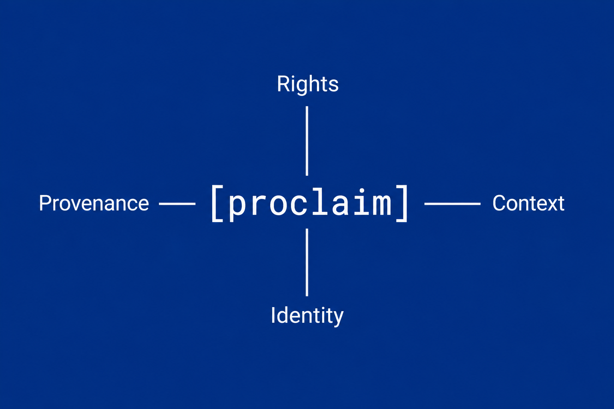
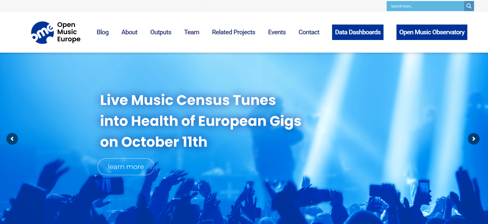

# Projects

::: callout-caution
## Incomplete

I am currently transfer here in a consistent manner the public presentations and reports of the past 10 years. You can find a lot more on [https://reprex.nl/](https://reprex.nl/p) and <https://danielantal.eu/>.  I am planning to finish the migration by 21 June 2026.
:::

## Prospective project ideas

### PROCLAIM {#sec-proclaim}

[{fig-alt="Provenance-Aware Claims and Machine-Readable Rights" fig-align="center"}](https://reprex.nl/project/proclaim/)

Journalistic archives introduce a semantic stabilisation problem that extends beyond traditional copyright management. While copyright infrastructures typically focus on identifying works, rightsholders, licences, and permitted uses, journalistic content also contains time-bound claims about events, persons, organisations, and public affairs.

A single journalistic article may simultaneously contain copyright-protected expression, references to identifiable persons, quotations from third parties, public records, freedom-of-information disclosures, and statements whose interpretation depends on historical and political context. As articles are reused, translated, summarised, linked, or processed by AI systems, the semantic relationship between these elements may become unstable.

The proposed `Provenance-Aware Claims and Machine-Readable Rights` ([proclaim](https://reprex.nl/project/proclaim/)) project investigates how semantic stabilisation methods can be applied to journalistic knowledge systems. The objective is to create machine-actionable representations linking articles, statements, events, actors, provenance assertions, and rights expressions. These representations would support lawful reuse, cross-border editorial collaboration, and AI-mediated information environments while preserving contextual integrity.

From the perspective of semantic stabilisation, PAJRA investigates a transition from entity stabilisation to claim stabilisation. The central question is not merely whether two identifiers refer to the same person or work, but whether two statements, potentially created in different languages, jurisdictions, or political contexts, support equivalent interpretations and inferences.

The project also serves as an experimental environment for studying provenance-aware rights expression, machine-readable policy frameworks such as ODRL, and the interaction between copyright, data protection, personality rights, editorial constraints, and public-interest exceptions. In this sense, journalistic archives provide a particularly demanding test case for semantic stabilisation because legal, semantic, and ethical constraints must remain aligned throughout the lifecycle of information.

### OpenSync {#sec-opensync}

The planned `OpenSynch` project addresses a structural gap in the cultural and creative sectors: the lack of interoperable, machine-readable metadata and rights information that prevents large parts of European music and audiovisual repertoires from being accessible and reusable.

The project develops and validates a workflow layer that enables continuous synchronisation of metadata and rights information across stakeholders (archives, CMOs, producers, distributors), supporting the identification, clarification, and activation of works and recordings.

flow layer that enables continuous synchronisation of metadata and rights The objective is not to create a new platform, but to make existing infrastructures work together, such as CMOs, archives, the Orphan works and Out-of-Commerce works and CommonsDB through interoperable, machine-actionable data and workflows aligned with CITF principles.

**Alignment with the CITF requirements**: OpenSynch directly tests and implements several requirements from the CITF First Project (Annex 3), in particular: 
-  Machine-readable rights expression: development of structured, incremental representations aligned with CITF directions 
-  Interoperability across systems: enabling exchange of copyright-relevant data between heterogeneous infrastructures 
-  Linking works, recordings, and contributors: improving identification and relationship modelling across sectors 
- Workflow integration: embedding rights data into operational processes (catalogue onboarding, distribution, reuse) The project focuses on practical implementation of these requirements in real-world workflows rather than theoretical modelling.

## Current projects

### FinFAIR (Awarded Projects from the First Call – Data in Echoes-ECCCH)

Finno-Ugric Dataspace: interconnecting the tangible and intangible heritage of regional identity groups under the framework of ECCCH

### OpenHerit (Awareded Projects from the Second Call in Echoes-ECCCH)

### Andrássy Archives

### Hungarian Motion Picture Data Sharing Space

## Past projects

### OpenMuse {#sec-openmuse}

Reprex initiated and carried out the largest part of this three-year and many stakeholder Horizon Europe Research and Innovation Action, with leadership in one Work Packages and several tasks in other work packages. 

OpenMusE brought  together music industry stakeholders and researchers from 11 EU countries and Ukraine. Our consortium recognises that placing European music ecosystems on a more competitive, fair, and sustainable footing requires evidence-based policymaking, business planning and accuracy. We provide the data needed for these actions.

Using transparent methods and tools, OpenMusE maps the policy as well as the data landscape. The project bridges data gaps and empowers stakeholders and policymakers to take data-driven actions. Our project is grounded on principles of open policy analysis, open science, and open-source software development. We work with stakeholders to identify data gaps on the EU, national, and regional levels; co-create indicators and methods for bridging them; develop free software tools for data collection and analysis; and report our findings and every step taken to reach them.

Using the OMO (Open Music Observatory) and our open-source software, music SMEs without technical departments or expertise will be able to access and analyse open data; model volume and value, including of zero-price uses; create better business models; and generate corporate social responsibility and sustainability reports; all at a fraction of current costs. We validate these tools in four pilot studies that will bring concrete benefits to stakeholders within the project lifespan.

### Music Eviota {#sec-music-eviota}

The Eviota project aims to develop sustainability reports directly linked to the financial accounts of companies, NGOs, and civil society organisations. The initial phase focuses on estimating greenhouse gas emissions and air pollutants. Our goal is to generate reliable, expenditure-based estimates of the carbon and pollution footprint of music-related social enterprises—an approach we refer to as connected financial and sustainability reporting.or double materiality reporting.

The objective of the MusicAIRE GREEN Recovery Programme was to increase environmental sustainability and ecological awareness within the music sector. Its focus is on greening the industry—particularly live performances, festivals, and touring—while also supporting innovative start-ups that seek to reduce the environmental impact of online data storage and music distribution.

The Music Eviota project was supported by MusicAIRE. The MusicAIRE grant provided us with resources to support additional music businesses, civil society organisations, and researchers with high-quality data—free of charge during the project’s duration.

[Music Eviota](https://reprex.nl/project/musiceviota/)

## SurveyHarmonies

## Listen Local Lithuania

