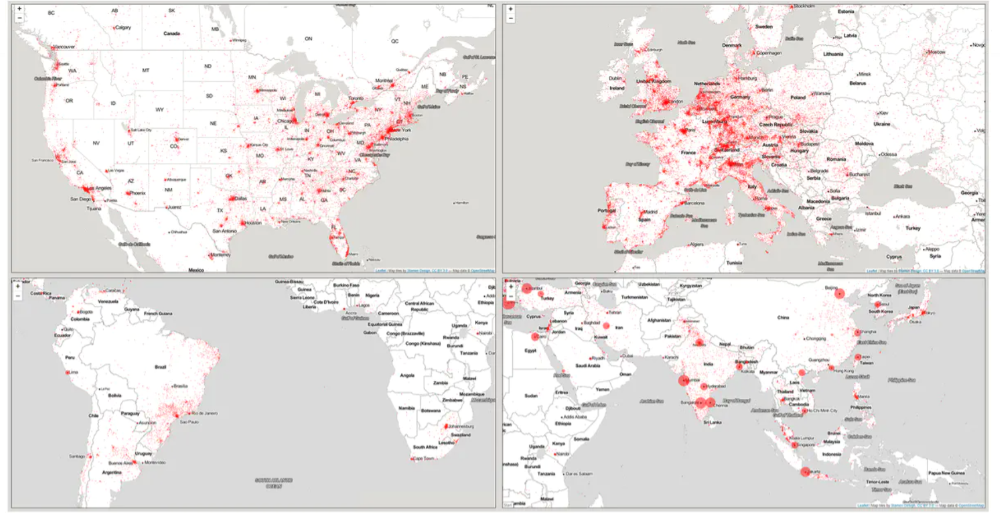

# Research

## Publications

### Federating Open Knowledge through Wikibase: The Case of The Finno-Ugric Data Sharing Space {#sec-publication-dnhb-2025}

This paper presents the design and early implementation of the Finno-Ugric Data Sharing Space (DSS), a multilingual, community-driven prototype for linking cultural heritage data across institutional and geographic boundaries. Rather than a finished infrastructure, the DSS should be read as a blueprint and exploratory model—developed as a thought experiment with minimal resources but grounded in our prior work on music metadata governance involving both public and private actors.

This paper presents the design and early implementation of the Finno-Ugric Data Sharing Space (DSS), a multilingual, community-driven prototype for linking cultural heritage data across institutional and geographic boundaries. Rather than a finished infrastructure, the DSS should be read as a blueprint and exploratory model—developed as a thought experiment with minimal resources but grounded in our prior work on music metadata governance involving both public and private actors. We use this experimental setting to review structural problems in existing Finno-Ugric knowledge systems: the negative outcomes of Wikipedia’s Livonian and Mari initiatives, the dispersion of diasporic knowledge, and the limitations of national GLAM infrastructures. Building on empirical literature and our own governance practice, we propose a lightweight federated infrastructure built on Wikibase and open ontologies, which enables multilingual vocabularies, contextual annotation, and ethical data linking without flattening local epistemologies. Case studies of Seto textile collections and the Hõimulõimed multilingual song archive illustrate how the prototype supports cultural reconstruction and participatory enrichment. While not an institutional solution, the DSS demonstrates how a semantically rich, community-anchored model can serve as a testbed for broader applications in low-scale cultural ecosystems.

Co-authors: Kata Gábor, Ieva Pigozne, Bogáta Tímár In *Digital Humanities in the Nordic and Baltic Countries Publications*

### Linking Garments to Knowledge: TextileBase as an Interdisciplinary Graph for Dress and Textile Research {#sec-publication-textilebase}

This article introduces `TextileBase`, a multilingual knowledge graph that connects dispersed data on garments from museums, archives, and libraries. By transforming artefact records, photographs, and texts into interoperable knowledge statements, it enables interdisciplinary research across dress history, ethnography, and sustainable fashion. The preprint demonstrates early results using Baltic and Finno-Ugric datasets and shows how TextileBase improves searchability, semantic interoperability, and reuse of cultural heritage data.

The article demonstrates how dress history and textile-related research can be enhanced through the interoperability of knowledge provided by a knowledge graph. The growing availability of digital cultural and historical data is not matched by a similar increase in their usability. Therefore, expanding the search radius to collections across disciplines and countries requires harmonisation and interoperability of knowledge. Reprex has created TextileBase – a knowledge base fully interoperable with libraries, archives, museums, the open knowledge system Wikidata, and open science repository systems. The article highlights key considerations when formulating searches and addressing terminology dissimilarities to ensure that data providers working across country, language, or disciplinary boundaries understand the intended meaning. To improve and streamline searchability in libraries for textual sources mentioning relevant historical garments, archives for their contemporary depictions, and museum collections for new artefacts, TextileBase transforms data and metadata into knowledge statements, links terms to an international controlled vocabulary, and carefully compares the works of various research and collection institutions.

Journal article in *Culture Crossroads*, Vol. 28, 2025

Co-author: Ieva Pigozne

### A szlovák adatkicserélési tér magyarországi föderációjának lehetőségei {#sec-networkshop-publication}

The aim of the `Slovak Comprehensive Music Database` (SKCMDb) is to provide a trustworthy description and easy access to all music created on the territory of the modern Slovak Republic or created by musicians who have lived in Slovakia, use the Slovak language or claim Slovak identity. It does not aim to define „Slovakness” in legal or ethnomusicological terms; it wants to make the new music made in the country visible and provide access to its music heritage, including the heritage of its minority communities. The linked databases, supported by a data sharing space, create an unprecedented undertaking that aims for organisational, legal, semantic, and technical interoperability among the data systems of Slovak public institutions and the rights management organisations and enterprises of the private sector. My conference lecture and publication focused on its replicability and the possibility of data federation with Hungarian music data owners[^research-1].

[^research-1]: *A szlovák adatkicserélési tér magyarországi föderációjának lehetőségei* [@antal_hungarnet_2024]

### Pilot Program for Novel Music Industry Statistical Indicators in the Slovak Republic

Abstract here.[^research-2]

[^research-2]: *Pilot Program for Novel Music Industry Statistical Indicators in the Slovak Republic* [@slovak-cult-stat-pilot]; *Retrospective Harmonisation of the KULT Slovak Cultural Surveys* [@antal_kult_harmonization_2023]

### Ensuring the Visibility and Accessibility of European Creative Content on the World Market: The Need for Copyright Data Improvement in the Light of New Technologies

This influential article analyses how Europe can strengthen the visibility and accessibility of its cultural and creative works by improving copyright data infrastructures. It highlights the risks of poor metadata, the opportunities of Article 17 of the CDSM Directive, and the importance of trustworthy systems for licensing and remuneration. The music sector, where fragmented metadata leads to lost royalties and unfair competition, provides key examples. The work continues to inform our projects on trustworthy AI, data governance, and cultural data spaces.

Type Journal article Publication In Journal of Intellectual Property, Information Technology and Electronic Commerce Law This article, published in JIPITEC in 2022, remains one of our most cited works on copyright, metadata, and cultural policy.

The paper shows how fragmented copyright metadata undermines the visibility of European creative works, causes royalty losses for artists, and limits the ability of European industries to compete globally in emerging areas like AI training and recommender systems.

Using the music industry as a central case study, the article highlights why improved metadata and licensing infrastructures are vital. Its findings directly connect to our current projects on trustworthy AI, cultural data spaces, and fair remuneration systems.

Read the published version in JIPITEC: Full text PDF

### Feasibility Study On Promoting Slovak Music In Slovakia & Abroad {#sec-slovak-feasibility-study}

Why are the total market shares of Slovak music relatively low both on the domestic and the foreign markets? How can we measure the market share of the Slovak music in the domestic and foreign markets? We offer some answers and solution based on empirical research and with the creation of a database and an AI application.

**Type** [Report](https://danielantal.eu/publication/#4) Published by *SOZA*.

Download the study [in Slovak](https://zenodo.org/record/6427556/files/Listen_Local_Feasibility_Study_2020_SK.pdf?download=1) or [in English](https://zenodo.org/record/6427514/files/Listen_Local_Feasibility_Study_2020_EN.pdf?download=1).

In 2015, realizing the low visibility and income-generating potential of Slovak music, the legislation introduced an amendment to the broadcasting act to regulate local content in radiostreams. The Slovak content promoting policy was well-intended but not based on any impact assessment, and it reached its goal only partially.

The Slovak broadcasting quotas in comparison with other national quotas a very simple, and they are impossible to measure, which makes both compliance and enforcement very difficult. Radio editors do not get any help to find music that fits into the playlists and fulfil the quota obligations – in many cases, it is impossible for them to find out if a song actually meets the quota requirements. For the same reason, neither is enforcement possible.

Another deficiency of the broadcasting quotas is that because of its fuzzy target, it is not clear whom it tries to help, and it has few friends. It is unclear how performers, composers or Slovak music producers can benefit from the system. Furthermore, it only helps a few genres, and it decreases the chances of other Slovak music in instrumental and non-Slovak language genres (for example, classical, jazz, rock) to be heard.

And at last, radio is losing its importance in music discovery. New generation find the music during their music discovery age on YouTube and digital streaming platforms. A Slovak content promoting policy that does not work on digital streaming platforms will be obsolete when radio content providers will switch to digital streaming in the foreseeable future.

**Our Feasibility Study follows the following logic:** In the first chapter we introduce various music recommendation systems in the context of local content promotion polices, like local mandatory content quota regulations.

In the second chapter, we consider the market-based or creative industry economy supporting policy goals, measurements, and potential support given to artists and producers.

We then turn in the third chapter to content-based local regulations promoting the use of the Slovak language or Slovak music content, irrespective of the performers and producers nationality, residence or ethnicity.

We introduce the idea of the **Slovak Music Database**, a comprehensive, mainly opt-in, opt-out database that of Slovak artists and Slovak music that should be supported by the local content regulation and other policies. We also create a Demo Slovak Music Database to understand the problem and scope of the creation of the comprehensive version.

The project website contains the [Demo Slovak Music Database](https://listen-local.net/project/demo-sk-music-db/).

We also created a [Demo Recommendation System](https://listen-local.net/project/demo-app/). We explain here [why](https://listen-local.net/post/2020-11-23-alternative-recommendations/).

- Why are the total market shares of Slovak music relatively low both on the domestic and the foreign markets?

- How can we measure the market share of the Slovak music in the domestic and foreign markets?

- How can we measure the value gap between what some media platforms, most particularly the biggest YouTube, does not pay out to the Slovak stakeholders within Slovakia?

- What is the interplay of the various definitions on market share and national quota targets?

- How ‘shadow-markets’ of home copying and unlicensed media platforms, such as YouTube impact market shares directly and national quotas indirectly?

- How can modern data science, predictive microeconomics and statistics help increase the market share of Slovak music in Slovakia and abroad?

Thanks for the entire Reprex team who contributed to the English version:

- **Dr. Emily H. Clarke**, musicology

- **Stef Koenis**, musicologist, musician

- **Dr. Andrés Garcia Molina**, data scientist, musicologist, editor

- **Kátya Nagy**, music journalist, research assistant;

and the Slovak version:

- **Dominika Semaňáková**, musicologist, editor

- **Dáša Bulíková**, musician, translator.

### Can scholarly pirate libraries bridge the knowledge access gap? An empirical study on the structural conditions of book piracy in global and European academia {#libgen-publication}

The topic of the paper is Library Genesis (LG), the biggest piratical scholarly library on the internet, which provides copyright infringing access to more than 2.5 million scientific monographs, edited volumes, and textbooks. The paper uses advanced statistical methods to explain why researchers around the globe use copyright infringing knowledge resources. The analysis is based on a huge usage dataset from LG, as well as data from the World Bank, Eurostat, and Eurobarometer, to identify the role of macroeconomic factors, such as R&D and higher education spending, GDP, researcher density in scholarly copyright infringing activities.

{fig-align="center"}

Published in [PLOS One](https://journals.plos.org/plosone/) is the fourth most influential multidisciplinary journal after Nature, and Science, and Proceedings of the National Academy of Sciences of the United States of America (based on [H index](https://www.scimagojr.com/journalrank.php?category=1000&area=1000&order=h&ord=desc).) On December 3, 2020 it published [a paper](https://journals.plos.org/plosone/article?id=10.1371/journal.pone.0242509) co-authored by Dr. Balazs Bodo, associate professor at the Institute for Information Law (IViR), Daniel Antal (Reprex), a data scientist interested in reproducible research, as an independent researcher, and Zoltan Puha, a Data Science PhD at Tilburg University, JADS. PLOS (Public Library of Science) is a nonprofit Open Access publisher, empowering researchers to accelerate progress in science and medicine by leading a transformation in research communication.

The article utilizes the our reproducible datasets created with our [regions](#sec-regions-package) package, and builds on many years of expertise in empirical research on the field of music and audiovisual piracy, home copying and private copying compensation (see for example [Private Copying in Croatia](https://dataandlyrics.com/publication/private_copying_croatia_2019/).) Our aim is to provide reliable, high quality indicators for the creative industries not only on national, but provincial, state, regional and metropolitan area level, too, because these levels are often more relevant for creators, performers and policy-makers.

The topic of the paper is Library Genesis (LG), the biggest piratical scholarly library on the internet, which provides copyright infringing access to more than 2.5 million scientific monographs, edited volumes, and textbooks. The paper uses advanced statistical methods to explain why researchers around the globe use copyright infringing knowledge resources. The analysis is based on a huge usage dataset from LG, as well as data from the World Bank, Eurostat, and Eurobarometer, to identify the role of macroeconomic factors, such as R&D and higher education spending, GDP, researcher density in scholarly copyright infringing activities.

### Central European Music Industry Report

The results of the first Hungarian, Slovak, Croatian and Czech music industry reports are compared with Armenian, Austrian, Bulgarian, Lithuanian, Serbian and Slovenian data and findings.

**Type**

[Report](https://danielantal.eu/publication/#4)

CEEMID & Consolidated Independent presented and discussed with stakeholders the [Central & Eastern European Music Industry Report 2020](https://danielantal.eu/publication/ceereport_2020/) as a case-study on national and comparative evidence-based policymaking in the cultural and creative sector on the [CCS Ecosystems: FLIPPING THE ODDS Conference](http://creativeflip.creativehubs.net/2019/12/03/flipping-the-odds/) – a two-day high-level stakeholder event jointly organized by Geothe-Institute and the DG Education and Culture of the European Commission with the Creative FLIP project.

The CEE Report builds on the results of the first [Hungarian](https://danielantal.eu/publication/hungary_music_industry_2014/), [Slovak](https://danielantal.eu/publication/slovak_music_industry_2019/), [Croatian](https://danielantal.eu/publication/private_copying_croatia_2019/) and [Czech](http://czdev.ceemid.eu/) music industry reports are compared with Armenian, Austrian, Bulgarian, Lithuanian, Serbian and Slovenian data and findings.

Our research findings were earlier presented and discussed in Vienna, Prague, Budapest and Bratislava with stakeholders.

You can find the earlier presentations in the [blog](https://danielantal.eu/publication/ceereport_2020/#posts) section of the website.

The first Central European Music Industry Report is the result of a co-operation that started among stakeholders in three EU countries five years ago to measure the economic value added of music – the basis of a modern royalty pricing system. This gave birth to CEEMID, originally the Central & Eastern European Music Industry Databases, a data integration programme that now in 2020, covers all of Europe. CEEMID fulfils similar roles to the planned European Music Observatory and supports all pillars of the future pan-European system.

The comparison of Western and Eastern music audiences reveals key demographic differences that make the unchanged adoption of business practices from mature markets in the region questionable. [Chapter 2](http://ceereport2020.ceemid.eu/audience.html) of this report will show these differences and their consequences on music markets, in terms of visiting and acquisition likelihood, frequency, seasonality and purchasing capacity. This is an example of how CEEMID fulfils the role of Pillar 3 (music, society and citizenship) in the planned European Music Observatory.

[Chapter 3](http://ceereport2020.ceemid.eu/supply.html) contrasts market demand with the supply strategies of musicians. CEEMID has been surveying music professionals, including artists, technicians and managers about their working conditions, market conditions and plans for five years across a growing number of countries. In 2019 we invited 100 national and regional stakeholders to distribute our surveys. In some countries, our surveys already have several years of historic data, making the resulting musician database probably the largest ever source of data about how music is produced and how musicians live. We are constantly looking for partners to roll out this survey to new countries in new languages.

The CEE region has comparative advantages in big music events like festivals, and it has become one of the most important hubs for cultural tourism in the world. We explain this phenomenon in Chapter 4 by showing the differences in demand composition, demography and supply of venues in the second chapter. The lack of a modern and dense network of permanent music venues gave rise to magnificent music festivals in the CEE. Open’er, Sziget and Exit are among the biggest and best festivals in the world, closely followed by several smaller festivals in all countries. The share of festivals in the live music market is many times higher than in Western Europe and they provide vital export revenues to the local music economies. However, they play a limited role in finding new audiences for local artists, as they are increasingly programming for Western audiences by providing shows of international hits. They can only very partially fill in the gaps left by the small venue problem that hit the emerging markets harder than the UK or Australia, where policy action had been already taken to reverse the decline of the availability of smaller live music venues.

On the recording side, our analysis shows that modern digital services are growing at a faster rate than in mature markets. Because of lower repertoire competition, streaming quantities are similar for a typical Austrian, Czech, Hungarian, Polish or Slovak track than in the mature markets. However, revenue growth is limited because of the interplay of several analysed factors. Our analysis of the live and recorded music markets shows that CEEMID fulfils the roles of the Pillar 1 (music economy) of the planned European Music Observatory.

Most recorded music sales revenue in the region comes from streaming platforms, just like in the mature markets. Successful sales strategies require a solid knowledge of the global marketplace and the ability to understand and train sales algorithms. Micro-enterprises, such as independent labels, have very limited ability to cope with these functions, given that they do not have market research or R&D functions. CEEMID and Consolidated Independent have started initiating open, national R&D consortia to create the necessary concentration in data assets, analytical capacity and budgets to close this gap. As a first step, CEEMID and Consolidated Independent have created a large, independent music dataset based on hundreds of millions of royalty statement entries to create our market indexes, styled after stock market and bond market indexes. Streaming opportunities are fast changing as roll-out of streaming services is happening at a different rate in various territories; subscription charges and the exchange rate to the producer’s currency vary and repertoire competition emerges in the market. Our volume and revenue indexes in [Chapter 5.3](http://ceereport2020.ceemid.eu/export.html#recexport) are aimed at creating sales algorithms that optimize sales volumes and expected revenues. We believe that this analysis also reveals that CEEMID partially fulfils the roles of Pillar 2 (music diversity and circulation) and feeds important data into Pillar 4 (innovation).

The region has far bigger untapped potential than most music business executives believe. Households in the region spend a significantly lower share of their recreational budget on music than their Western, Southern or Nordic peers. The region has a lot of untapped cultural purchasing power because servicing is particularly challenging in both the live and recorded sides of the business.

This upside potential cannot be tapped without better pricing. Royalty levels are often very low in the region. Due to many combined effects analysed in this short report, the gap between royalties earned in the CEE and Western Europe is several times bigger than the difference in GDP or national average wage. These gaps are partly caused by special interests preventing collective management from charging appropriate tariffs for restaurants, media companies or electronic appliance importers and manufacturers, and partly by unfavourable taxation of cultural products and services.

CEEMID was designed to create economic evidence on royalty pricing, private copying compensation and the creation of economic value added in the industry. In the first Hungarian Music Industry Report of ProArt and in the first Slovak Music Industry Report we have shown that economic and taxation policies of the CEE countries aimed to support car and electronics manufacturing create a distorted, unfavourable economic regime for creative industries. We want to help local stakeholders with economic evidence to correct these discriminatory policies during the overhaul of the EU VAT system. We have been helping various national organizations with economic evidence, presented in the light of latest EU jurisprudence, to improve their pricing activities. Our thousands of indicators were also used in ex ante evaluations of granting schemes.

In 2020, all EU member states will change their copyright administration legislation because of the national implementations of the 2019/790 Digital Single Market directive. CEEMID provides evidence in several countries about the size and impact mechanism of the value transfer, and generally the widespread use of the copyright exemption for private copying. We believe that the thousands of pan-European music industry indicators that we have aggregated over the five years will play a vital role in these regulatory processes.

CEEMID fulfils its roles with a very thorough exploitation of the EU’s 17-years-old Open Data regime with the re-use of public sector information, and a very careful mapping of the music industry. These maps help us conduct annual surveys among musicians and the audience, and they help us connect (always with pre-approval and with a user mandate) to industry databases. We do not only cover the EU countries, but increasingly (potential) candidate countries and neighbourhood countries.

In our vision, this data collection and integration, i.e. Pillars 1-3 should be available for all music stakeholders, should remain public and publicly funded. The last Pillar of the observatory, innovation, is where private entities should compete. The founders of CEEMID and Consolidated Independent believe that this report demonstrates the business and policy benefits of such a system with the analysis of the Central & Eastern European music markets. We believe that this way CEEMID is in a position to serve most of the planned functions of the envisioned European Music Observatory, and we are looking for ways to make either our thousands of indicators, or our data collection and integration software open source and available for all stakeholders in the EU and its neighbours. CEEMID was born out of necessity to level out the different levels of public research and statistical coverage of the EU member states. In our view, private entities in the future should focus their investments in Pillar 4 of the planned observatory, i.e. competing in innovation with creating new models, algorithms and services based on data that is available throughout the European Union without giving further advantage to the already mature markets.

### The Growth of the Hungarian Popular Music Repertoire: Who Creates It And How Does It Find An Audience

Chapter in the Studies in Popular Music: Made in Hungary, Routledge[^research-3].

[^research-3]: *The Growth of the Hungarian Popular Music Repertoire: Who Creates It And How Does It Find An Audience* [@antal_growth_2017]

